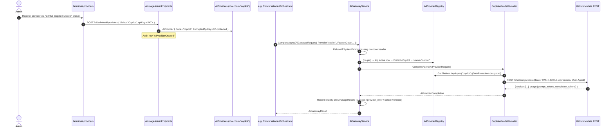

# GitHub Copilot SDK / GitHub Models — Integration Spec

> **Status:** Phase 1 implemented (May 2026). Adds GitHub Copilot / GitHub
> Models as a selectable AI provider behind the existing grounded
> `IAiGatewayService`. Voice (Pronunciation, Conversation TTS/ASR) and
> ElevenLabs configuration are unchanged.

## TL;DR

GitHub Copilot is a new `IAiModelProvider` named `"copilot"` that talks to
the OpenAI-compatible **GitHub Models** endpoint
(`https://models.github.ai/inference/chat/completions`). It is wired into
the existing AI plane:

- `AiGatewayService.BuildGroundedPrompt(...)` → `CompleteAsync(...)`
- `IAiProviderRegistry` row, `Code = "copilot"`, `Dialect = Copilot`
- `IAiCredentialResolver` (platform PAT or admin BYOK)
- `IAiQuotaService`, `IAiUsageRecorder` (one row per call, success or fail)
- Admin UI extends [`/admin/ai-providers`](../app/admin/ai-providers/page.tsx)
  with a **GitHub Copilot / Models** preset and a `Copilot` dialect option.

No new tables. No new migration. No streaming. No tool calling. No
per-learner GitHub OAuth.

---

## Why GitHub Models, not the Copilot SDK NuGet

The official `GitHub.Copilot.SDK` NuGet wraps the Copilot CLI as a
JSON-RPC subprocess and is built for agent runtimes (planning, tool
invocation, file edits). Shipping it in our ASP.NET 10 Linux container
would require bundling the CLI binary and forking a process per request —
unnecessary overhead for grounded chat completions.

GitHub Models exposes the same models behind an **OpenAI-compatible
chat-completions REST API** with two GitHub-specific headers
(`X-GitHub-Api-Version`, `User-Agent`). This is a near-zero-effort fit
for the existing `OpenAiCompatibleProvider` shape, so the new provider is
a thin `HttpClient`-only adapter.

Reference: <https://docs.github.com/en/rest/models/inference>.

---

## Architecture (no plumbing changes)

---

## Authentication

**Platform default:** Server-side fine-grained GitHub PAT with the
`models:read` scope. Pasted into the admin form, stored encrypted via
`IDataProtectionProvider.CreateProtector("AiProvider.PlatformKey.v1")` —
the same purpose string as every other provider.

**Optional second mode:** Admin-pasted **BYOK PAT** for an alternate
GitHub org. Treated as the same `ApiKey` column. Per-feature platform-only
allowlists in `IAiCredentialResolver` continue to apply (scoring features
refuse BYOK by policy).

**Explicitly NOT supported:** per-learner GitHub OAuth. Students aren't
expected to own GitHub Copilot subscriptions, and per-user GitHub identity
would cross-contaminate `AiUsageRecord.UserId`.

For org-attributed billing and a higher rate-limit tier, swap the base URL
to `https://models.github.ai/orgs/{ORG_LOGIN}/inference` in the admin
form. No code change required.

---

## Voice features — explicitly excluded

GitHub Copilot is **text-only**. The following remain on their dedicated
provider selectors (per AGENTS.md mission-critical invariants):

- `IConversationTtsProviderSelector` (ElevenLabs / Azure / CosyVoice / …)
- `IConversationAsrProviderSelector` (Azure / Whisper / Deepgram)
- `IPronunciationAsrProviderSelector` (Azure phoneme / Whisper-stage1)
- `RecallsTtsService` (delegates to the conversation TTS selector)

ElevenLabs admin configuration stays at
[`/admin/content/conversation/settings`](../app/admin/content/conversation/settings/page.tsx).
**Do not** add an ElevenLabs surface to `/admin/ai-providers` — voice
provider routing is not part of the `IAiModelProvider` contract.

---

## Phase 1 scope (shipped)

- [x] `AiProviderDialect.Copilot = 3` (enum-only — no schema migration
      needed; EF stores enums as int).
- [x] `CopilotAiModelProvider : IAiModelProvider` with `Name = "copilot"`.
- [x] DI registration + named `HttpClient` `"AiCopilotClient"`.
- [x] Gateway dialect map: `Copilot → "copilot"`.
- [x] Admin UI preset `github-copilot` + `Copilot` dropdown option.
- [x] TS dialect union extended with `'Copilot'`.
- [x] Backend xUnit (HappyPath / NoRow / NonOk / BYOK override / array
      content / model required).
- [x] Frontend Vitest (preset render / submit shape / no-secret-leak / RBAC).

## Out of scope (explicitly deferred)

- **Streaming.** Gateway is request/response with usage tallied at
  completion. Adding partial-token accounting + cancellation semantics is
  a separate phase via a future `IAiStreamingRecorder`.
- **Tool calling / agents / sessions.** Multi-turn tool invocations
  break the "exactly one `AiUsageRecord` per `CompleteAsync`"
  invariant and would silently bypass quota. Disabled at the wire level
  (no `tools[]` field emitted).
- **Test-connection endpoint.** Existing admin UX validates by saving the
  row + using it through the gateway; per-row `LastTestedAt` /
  `LastTestStatus` columns are deferred until phase 2.
- **MCP / file edits / repo access.** Server-side OET grading does not
  need them.

---

## Operational notes

### Required environment

No new env vars. Everything lives in the `AiProviders` row.

The legacy fallback env block `AI__*` (used by `OpenAiCompatibleProvider`
when no DB row is configured) is unchanged.

### Cost reporting

`AiUsageRecord` populates from `usage.prompt_tokens` /
`usage.completion_tokens` in the GitHub Models response — same field
names as OpenAI. Per-1k pricing comes from `AiProviders.PricePer1k*`
which the admin sets in the form. Default preset values target
`openai/gpt-4o-mini` (May 2026 pricing); update if you change
`DefaultModel`.

### Rate limits

GitHub Models free / preview tier is too small for production traffic
(see [Prototyping with AI models — Rate limits](https://docs.github.com/en/github-models/use-github-models/prototyping-with-ai-models#rate-limits)).
Production deployments must opt the GitHub org into paid GitHub Models
or the Azure AI Foundry equivalent before flipping `IsActive=true`.

### Privacy / data residency

OET writing samples and conversation transcripts may contain patient-style
PII generated by the role-play. Privacy review is a hard prerequisite
before `IsActive=true` for the Copilot row. Default `IsActive=false` in
the admin preset enforces this.

---

## How to enable

1. Sign in to `/admin/ai-providers` as an admin with the `ai_config`
   permission.
2. Click **+ Register provider** → **GitHub Copilot / Models** preset.
3. Paste a fine-grained GitHub PAT with `models:read` scope. Keep
   `IsActive` off for the first save.
4. Open `/admin/ai-config` → optionally set per-feature `provider`
   to `copilot` for non-scoring text features (`vocabulary.gloss`,
   `recalls.mistake_explain`, `conversation.opening`, …).
5. Verify a small call succeeds (any feature you routed). Check
   `/admin/ai-usage` shows a `Success` row with `providerId="copilot"`.
6. Flip `IsActive=true`. The kill-switch and quota enforcement at
   `/admin/ai-usage → Budget & Kill-switch` continue to govern this
   provider exactly as they govern every other registered provider.

---

## How to disable

Either flip `IsActive=false` on the row in `/admin/ai-providers`, or trip
the global kill-switch in `/admin/ai-usage → Budget & Kill-switch`. Both
short-circuit before any HTTP call to GitHub Models.

---

## Files changed

| Layer | File | Change |
|---|---|---|
| Backend | `backend/src/OetLearner.Api/Domain/AiProviderEntities.cs` | `Copilot = 3` enum value |
| Backend | `backend/src/OetLearner.Api/Services/Rulebook/CopilotAiModelProvider.cs` | new — `IAiModelProvider` adapter |
| Backend | `backend/src/OetLearner.Api/Services/Rulebook/AiGatewayService.cs` | dialect map adds `Copilot → "copilot"` |
| Backend | `backend/src/OetLearner.Api/Program.cs` | DI registration + named `HttpClient` |
| Backend | `backend/tests/OetLearner.Api.Tests/CopilotAiModelProviderTests.cs` | new — 6 unit tests |
| Frontend | `lib/ai-management-api.ts` | `AiProviderDialect` union extended |
| Frontend | `app/admin/ai-providers/page.tsx` | preset + dropdown option |
| Frontend | `app/admin/ai-providers/page.test.tsx` | new — Vitest spec |
| Docs | `docs/AI-COPILOT-SDK-INTEGRATION.md` | this document |
| Docs | `docs/AI-USAGE-POLICY.md` | section appended |

No DB migration, no new tables, no schema change.
