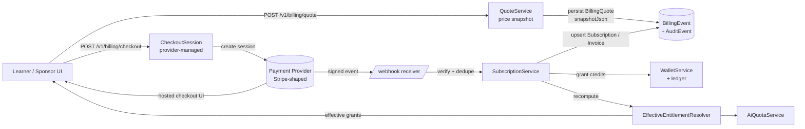
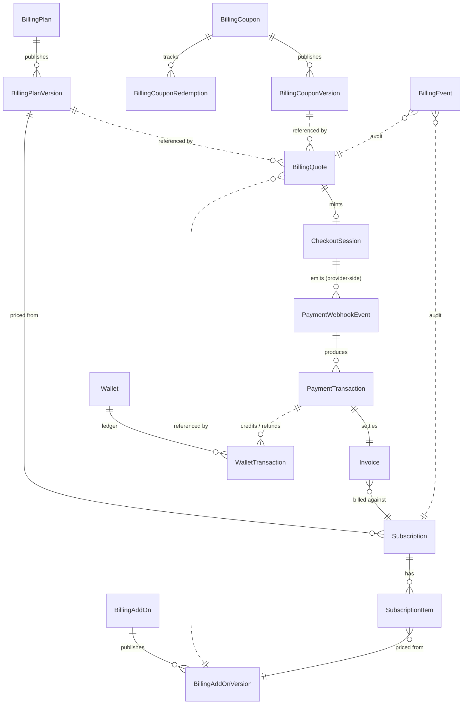
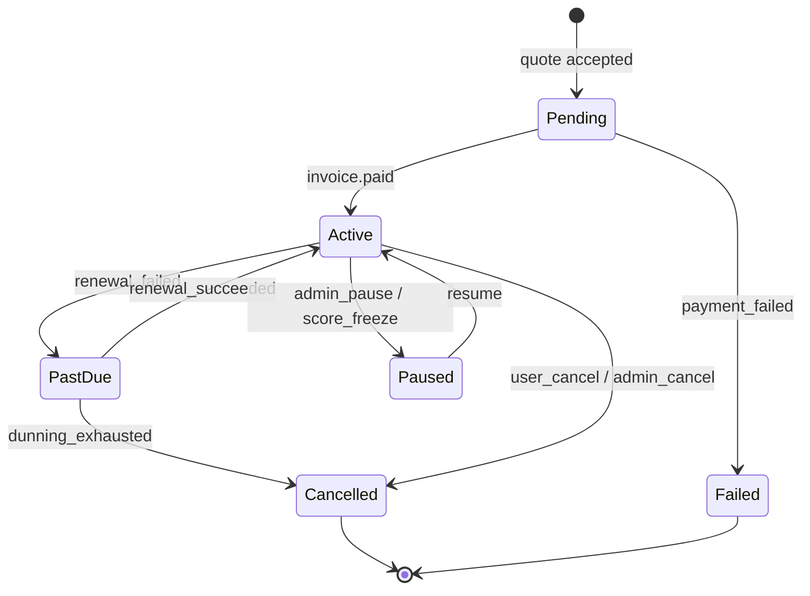
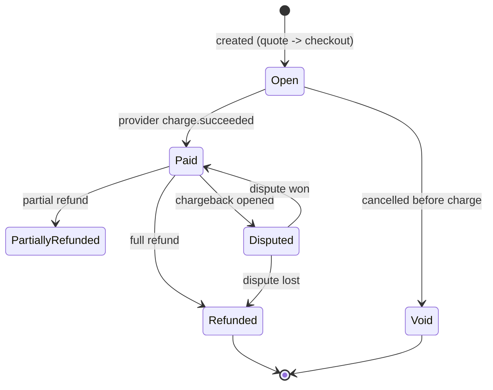
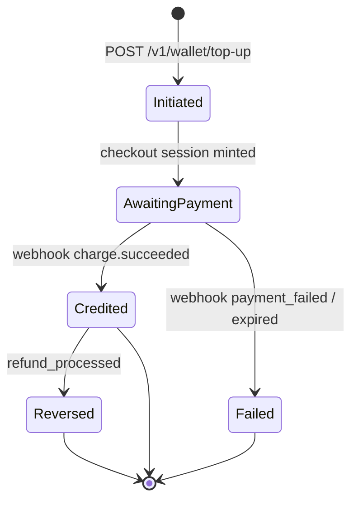
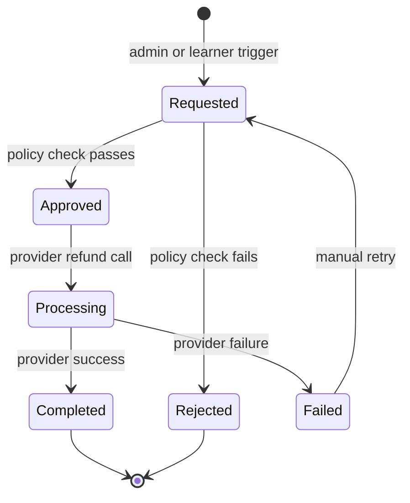
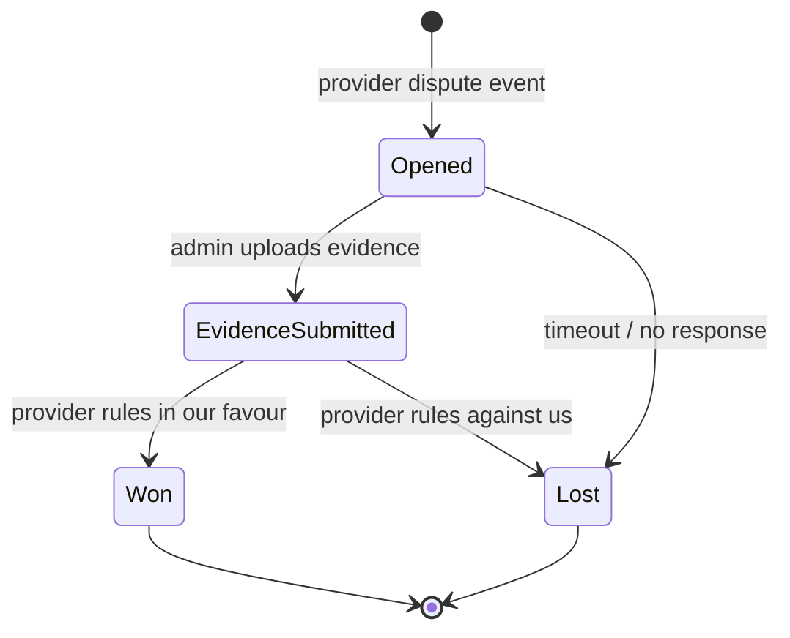

# Billing Module — Canonical Reference

> Status: living document. Owner: Billing slice (see `docs/billing-hardening/README.md`).
> Last reviewed: 2026-05-10.

This document is the canonical reference for the OET Prep billing subsystem.
It describes the runtime architecture, the data model, the state machines that
govern lifecycle transitions, the invariants the system must preserve, the
provider integration boundary, the RBAC surface, and the PII / retention
policy. It is the contract between the billing slice owners and every other
subagent / human contributor.

If a behaviour described here is not yet implemented, the gap is recorded in
[`docs/billing-hardening/I-docs.md`](./billing-hardening/I-docs.md) and tracked
against the owning slice. Do **not** silently weaken this document to match
current code — fix the code or escalate.

## Known v1 limitation: sponsor billing is heuristic-attributed

The sponsor billing read model in `SponsorService.ComputeBillingAsync`
attributes any **completed** `PaymentTransaction` row whose `LearnerUserId`
matches a learner inside an **active** sponsorship window
(`Sponsorship.CreatedAt..RevokedAt ?? now`) to that sponsor. This is a
**heuristic for the v1 launch** (decision recorded 2026-05-10 against
`RW-013` in `docs/STATUS/remaining-work.yaml`), not a true sponsor-paid
invoice link. Practical implication:

- If a sponsored learner pays for an upgrade themselves while a sponsorship
  is active, that spend currently shows on the sponsor's billing surface.
- If a sponsorship is revoked retroactively, transactions inside the prior
  active window remain attributed to the sponsor.

The post-v1 follow-up is a `SponsorshipId` foreign key (or a `payer_type`
column) on `PaymentTransaction`, populated from Stripe metadata at checkout.
Until then, the heuristic is intentionally simple and locked down by
`SponsorBillingReadModelTests` (5 cases) plus `SponsorContractTests` (2
shape locks).

---

## 1. Architecture

### 1.1 End-to-end flow

### 1.2 Component responsibilities

| Component | Responsibility | Key file (.NET) |
| --------- | -------------- | --------------- |
| QuoteService | Builds an immutable `BillingQuote` snapshot from current catalog versions, resolves coupon, computes totals. | `Services/LearnerService.Billing.cs` |
| Checkout orchestrator | Mints provider session, persists `CheckoutSessionId` + `IdempotencyKey` on the quote. | same |
| PaymentGatewayService | Provider abstraction: signature verification, deduplication, normalised event surface. | `Services/PaymentGatewayService.cs` |
| SubscriptionService | Applies normalised events: subscription create / renew / cancel, invoice create. | `Services/LearnerService.Billing.cs` |
| WalletService | Credit balance + ledger. Single source of truth for credits. | `Services/WalletService.cs` |
| RefundService | Issues refunds, writes reversing wallet entries, records `BillingEvent`. | `Services/Billing/RefundService.cs` (slice B) |
| DisputeService | Tracks chargeback lifecycle, freezes entitlement when configured. | `Services/Billing/DisputeService.cs` (slice B) |
| EffectiveEntitlementResolver | Composes plan + active add-ons + wallet + temporary grants into the resolved entitlement set. | `Services/EffectiveEntitlementResolver.cs` |
| AiQuotaService | Maps entitlement to AI feature quotas; consulted by the grounded AI gateway. | `Services/AiQuotaService.cs` |

---

## 2. Source-of-truth table

Billing is intentionally multi-tier: catalog rows are mutable for admin
ergonomics, but everything that affects money flows through immutable
versioned snapshots.

| Question | Authoritative source | Notes |
| -------- | -------------------- | ----- |
| What plans / add-ons / coupons currently exist? | `BillingPlan`, `BillingAddOn`, `BillingCoupon` (current rows) | Mutable. Admin CMS surface. **Never** referenced for past money movement. |
| What were the exact terms when the customer paid? | `BillingPlanVersion`, `BillingAddOnVersion`, `BillingCouponVersion` | Immutable. Created on every catalog publish. Referenced by id from `BillingQuote`, `Invoice`, `PaymentTransaction`. |
| What did the learner agree to at checkout? | `BillingQuote.SnapshotJson` + `PlanVersionId` / `AddOnVersionIdsJson` / `CouponVersionId` | Immutable post-create. Quote is the legal contract surface. |
| What is the active subscription state? | `Subscription` (latest row per user) | Mutable status field; transitions are append-only via `BillingEvent`. |
| What did the customer actually pay and when? | `Invoice` + `PaymentTransaction` | Append-only. `Invoice.Status` may transition (`Paid` → `Refunded`) but amounts are never edited in place. |
| What is the credit balance and history? | `Wallet.CreditBalance` + `WalletTransaction` ledger | Balance is a cached projection of the ledger. Ledger is append-only and authoritative. |
| Did we already process this provider event? | `PaymentWebhookEvent.GatewayEventId` (unique index) | Replay-safe. `PayloadSha256` detects payload tampering between retries. |

---

## 3. Data model

### 3.1 ER overview

> `CheckoutSession` is **not** a local entity — it lives in the payment
> provider. Its identifier is persisted as `CheckoutSessionId` on the quote,
> the payment transaction, the invoice, and (where applicable) the coupon
> redemption. This enables exact reconciliation without storing duplicate
> session state locally.

### 3.2 Field-level pointers

Catalog: [`backend/src/OetLearner.Api/Domain/AdminEntities.cs`](../backend/src/OetLearner.Api/Domain/AdminEntities.cs#L284)
(BillingPlan / BillingPlanVersion).

Catalog versioning + quote + redemption + webhook events:
[`backend/src/OetLearner.Api/Domain/BillingEntities.cs`](../backend/src/OetLearner.Api/Domain/BillingEntities.cs#L1).

Subscription / Invoice / Wallet:
[`backend/src/OetLearner.Api/Domain/Entities.cs`](../backend/src/OetLearner.Api/Domain/Entities.cs#L592).

---

## 4. State machines

### 4.1 Subscription

### 4.2 Invoice

### 4.3 Wallet top-up

### 4.4 Refund

### 4.5 Dispute

---

## 5. Invariants

Each invariant must be protected by at least one named test. Where a test
does not yet exist, it is flagged in `docs/billing-hardening/I-docs.md`.

| # | Invariant | Protecting test |
| - | --------- | --------------- |
| I1 | A `BillingQuote` is immutable after creation; price recompute requires a new quote. | `BillingQuoteImmutabilityTests.QuoteFieldsAreFrozenAfterCreate` (slice H, planned) |
| I2 | A `Subscription` always references a `BillingPlanVersion`, never a mutable `BillingPlan`. | `SubscriptionVersionPinningTests.SubscriptionPinsPlanVersion` (slice H) |
| I3 | An `Invoice` always references the same versions snapshotted on its source `BillingQuote`. | `InvoiceQuoteParityTests.InvoiceMatchesQuoteSnapshot` (slice H) |
| I4 | `PaymentWebhookEvent.GatewayEventId` is unique; replays are no-ops. | `PaymentWebhookIdempotencyTests.DuplicateEventIsIgnored` (slice B/H) |
| I5 | Webhook payload hash (`PayloadSha256`) for a given `GatewayEventId` cannot change between retries. | `PaymentWebhookIntegrityTests.PayloadHashCannotChange` (slice B/H) |
| I6 | A coupon cannot be redeemed beyond `UsageLimitTotal` even under concurrency. | `CouponRedemptionConcurrencyTests.OverRedemptionIsRejected` (slice C/H) |
| I7 | `Wallet.CreditBalance == sum(WalletTransaction.Amount)` per wallet, always. | `WalletLedgerInvariantTests.BalanceMatchesLedgerSum` (slice A/H) |
| I8 | Wallet writes use a row-level lock (or optimistic concurrency token) so concurrent debits cannot drive balance negative. | `WalletConcurrencyTests.DoubleSpendIsRejected` (slice A/H) |
| I9 | Refunds never delete `WalletTransaction` rows — they append a reversing entry. | `RefundLedgerTests.RefundAppendsReversingEntry` (slice A/B/H) |
| I10 | A `CheckoutSession` id appears on at most one settled `Invoice`. | `CheckoutDoubleSettlementTests.SessionSettlesOnce` (slice D/H) |
| I11 | Coupon eligibility / minimum-subtotal is evaluated against the quote snapshot, not against current catalog rows. | `CouponEligibilityVersioningTests.UsesSnapshotPricing` (slice C/H) |
| I12 | Subscription state transitions originate from a normalised webhook event or an admin action; never from inferred timer-only logic. | `SubscriptionTransitionAuditTests.EveryTransitionHasBillingEvent` (slice D/H) |

---

## 6. Provider integration boundary

The system is **gateway-agnostic** but **Stripe-shaped**: the abstraction
exposes the union of capabilities Stripe and PayPal provide today, and any
new provider must be written behind `IPaymentGatewayService`.

### 6.1 Outbound

* `CreateCheckoutSession(quote, idempotencyKey)` — must return a provider
  session id and a hosted-checkout URL. The idempotency key is the quote id
  prefixed with the gateway code; replays return the existing session.
* `CreateRefund(paymentTransactionId, amount, reason)` — synchronous result;
  asynchronous confirmation arrives via webhook.

### 6.2 Inbound (webhooks)

| Concern | Rule |
| ------- | ---- |
| Signature | Verified against the gateway's documented HMAC scheme **before** any persistence. Failures: HTTP 400, no row written, `Sentry.captureMessage` with `feature: 'billing'` tag. |
| Replay window | Reject events whose timestamp is more than **300 seconds** in the past or **60 seconds** in the future. Mirrors Stripe's tolerance. |
| Deduplication | `GatewayEventId` is the unique key. Duplicate ids return HTTP 200 (no-op) and increment `AttemptCount`. |
| Payload integrity | `PayloadSha256` is recorded on first receipt. Any retry whose hash differs is logged as `verification_status = 'failed'` and quarantined; admin must investigate. |
| Retry policy | Provider does the retrying. Our endpoint is idempotent; failure responses (5xx) instruct the provider to retry with exponential backoff. |
| Dead-letter | Events that fail processing 5+ times move to `ProcessingStatus = 'failed'` and surface in the admin "webhook backlog" view. They are never silently dropped. |
| Ordering | Not assumed. State machines tolerate out-of-order events by only advancing on monotonic transitions; out-of-order events that would regress state are recorded but ignored. |

---

## 7. RBAC matrix

The current granular permission set lives in
[`backend/src/OetLearner.Api/Domain/AuthEntities.cs`](../backend/src/OetLearner.Api/Domain/AuthEntities.cs#L160)
(`AdminPermissions`). Two billing-specific values exist today:
`billing:read` and `billing:write`. `system_admin` grants everything.

| Endpoint surface | Required permission |
| ---------------- | ------------------- |
| `GET /v1/admin/billing/plans` and version history | `billing:read` |
| `POST/PATCH /v1/admin/billing/plans/**` (catalog mutation) | `billing:write` |
| `GET /v1/admin/billing/addons` / `GET .../coupons` | `billing:read` |
| `POST/PATCH /v1/admin/billing/addons/**` / `.../coupons/**` | `billing:write` |
| `GET /v1/admin/billing/subscriptions` | `billing:read` |
| `POST /v1/admin/billing/subscriptions/{id}/cancel`, `.../pause`, `.../resume` | `billing:write` |
| `GET /v1/admin/billing/invoices` | `billing:read` |
| `POST /v1/admin/billing/refunds` | `billing:write` |
| `GET /v1/admin/billing/disputes` | `billing:read` |
| `POST /v1/admin/billing/disputes/{id}/evidence` | `billing:write` |
| `GET /v1/admin/billing/webhooks` (backlog view) | `billing:read` |
| `POST /v1/admin/billing/webhooks/{id}/retry` | `billing:write` |
| `GET /v1/admin/billing/wallet/{userId}` | `billing:read` |
| `POST /v1/admin/billing/wallet/{userId}/adjust` | `billing:write` |
| `POST /v1/admin/billing/wallet/tiers/**` | `billing:write` |
| Any endpoint that grants `manage_permissions` itself | `manage_permissions` (separate from `billing:*`) |
| `POST /v1/billing/webhooks/{provider}` | unauthenticated; signature gates access |
| `GET /v1/billing/quote`, `POST /v1/billing/quote`, `POST /v1/billing/checkout` | learner JWT |
| `GET /v1/wallet`, `POST /v1/wallet/top-up` | learner JWT |

> **Gap:** there is no granular split for refunds vs catalog edits. Slice C
> may propose `billing:refund` and `billing:catalog_publish` as additions.
> Tracked in `docs/billing-hardening/I-docs.md`.

---

## 8. PII and retention

| Data class | Lives in | Retention | Justification |
| ---------- | -------- | --------- | ------------- |
| Card PAN, CVV, full bank details | **Never stored.** | n/a | All card data flows through the provider's hosted UI; we receive only tokens / last-4 / brand. |
| `last4`, `brand`, `exp_month`, `exp_year` | Provider-side; surfaced on demand for receipts. | While subscription is active. | Required for receipts and dunning. |
| Billing address | `PaymentTransaction.MetadataJson` (provider-supplied) | Tax-record retention: **7 years** from invoice issue. | Required for VAT / GST audits. |
| Invoice line items + amounts | `Invoice`, `PaymentTransaction` | **7 years** from issue. | Tax / financial audit. |
| Webhook payloads | `PaymentWebhookEvent.PayloadJson` | **180 days** from receipt. | Forensic + reconciliation window. After that the row is retained but the payload column is nulled. |
| Wallet ledger | `WalletTransaction` | Lifetime of account, then **7 years** post-deletion. | Required to reconstruct entitlement history. |
| Refund / dispute notes | `RefundService` / `DisputeService` rows | **7 years**. | Regulatory + chargeback evidence. |
| Coupon redemption | `BillingCouponRedemption` | Lifetime of account. | Required to enforce per-user limits. |

PII never appears in Sentry events: the global `scrubPii` `beforeSend` hook
in [`lib/observability/sentry-shared`](../lib/observability/sentry-shared.ts)
strips request bodies, headers, and query params known to carry PII.

---

## 9. Observability

* All billing events emitted to Sentry are tagged `feature: 'billing'` via
  the event processor installed in [`instrumentation.ts`](../instrumentation.ts).
  This tag is the canonical filter for billing dashboards and alerts.
* Server-side, every state-changing billing call writes a row to
  `BillingEvent` (the operational ledger) and an entry to `AuditEvent`
  (the security ledger). The two are separate by design: one supports
  business reporting, the other supports forensic review.
* Metrics that must exist: webhook processing latency p95 / p99, refund
  success rate, coupon redemption rate, wallet ledger drift count
  (`Wallet.CreditBalance ≠ sum(ledger)`), dispute open count.

---

## 10. Related documents

* [`docs/billing-hardening/README.md`](./billing-hardening/README.md) — slice ownership matrix.
* [`docs/runbooks/billing-incident.md`](./runbooks/billing-incident.md) — operational runbook.
* [`docs/AI-USAGE-POLICY.md`](./AI-USAGE-POLICY.md) — billing → AI quota mapping.
* [`docs/subscription-system-hardening/`](./subscription-system-hardening/) — historical audit + target-state series.
* [`mission-critical-execution-ledger.md`](../mission-critical-execution-ledger.md) — escalation ledger.
