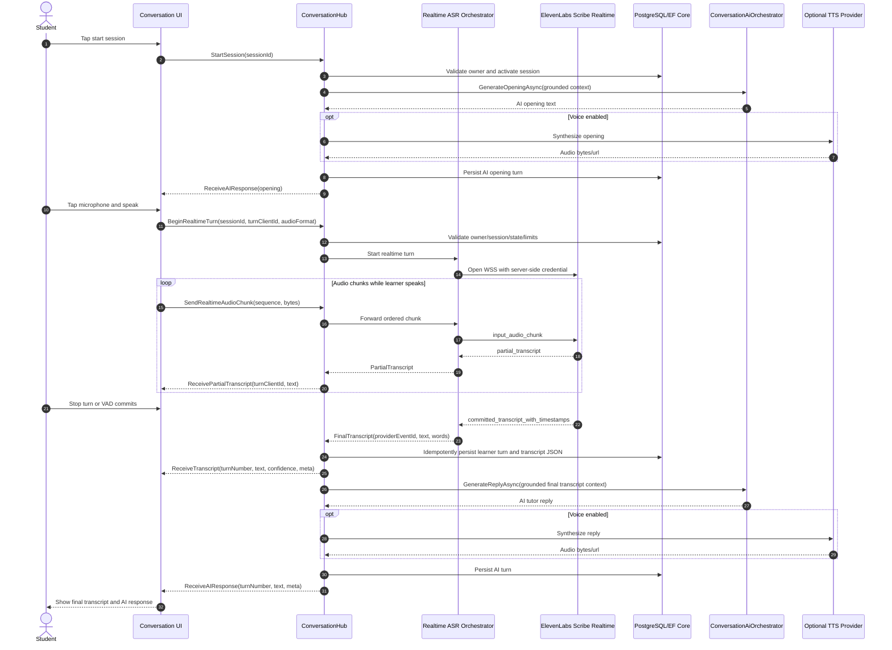

# ElevenLabs Realtime STT Implementation Plan

Date: 2026-05-14
Status: planning artifact, no code changes
Scope: Conversation-first live AI speaking practice, including Speaking self-practice sessions that deep-link into Conversation. Native Speaking task recording/evaluation pages are a follow-on integration surface after the Conversation realtime path is stable.

## 1. Executive Summary

This project already has the right product and backend backbone for live AI speaking practice: a Next.js learner UI, an ASP.NET Core API, SignalR conversation sessions, pluggable ASR/TTS providers, server-side transcript persistence, grounded AI tutor replies, and OET conversation evaluation. Speaking self-practice already delegates into the Conversation module through `LearnerService.StartSpeakingSelfPracticeAsync`, so the first production slice should enhance Conversation rather than build a parallel speaking stack. The gap is that the current live conversation flow is not truly realtime STT. The browser records a complete turn with `MediaRecorder`, sends a base64 blob to `ConversationHub.SendAudio`, and only then does the backend transcribe, persist, call the AI tutor, synthesize optional TTS, and update the UI.

ElevenLabs Scribe v2 Realtime should be integrated as a provider adapter, not scattered through UI and hub code. The production recommendation for this repo is a server-mediated realtime STT architecture for canonical transcripts, with an optional hybrid/client-token mode only for provisional captions or carefully gated experiments. This preserves the repository's mission-critical invariant that AI conversation sessions, audio, transcript turns, AI replies, and evaluation remain server-authoritative.

Primary recommendation:

- Keep ElevenLabs API keys server-side only.
- Add an `IConversationRealtimeAsrProvider` abstraction beside the existing batch `IConversationAsrProvider`.
- Implement an `ElevenLabsScribeRealtimeProvider` in the backend that connects to ElevenLabs realtime WebSocket and maps Scribe partial/committed events into internal transcript events.
- Stream partial transcript events to the frontend as UI-only state.
- Persist and evaluate only committed/final transcript segments observed by the backend.
- Reuse the existing `ConversationHub`, `ConversationAiOrchestrator`, `ConversationAudioService`, `ConversationOptionsProvider`, `ConversationTurn`, and evaluation pipeline.
- Keep TTS separate from STT and enforce half-duplex turn-taking so tutor audio is not captured as learner speech.

## 2. Current Project Analysis

### Detected Stack

- Frontend: Next.js App Router, React 19, TypeScript, Tailwind CSS 4, motion/react.
- Backend: ASP.NET Core Minimal APIs and SignalR, EF Core, PostgreSQL.
- Realtime: SignalR hubs are already mapped for notifications, conversations, and mock live rooms.
- Desktop/mobile: Electron and Capacitor are present. Microphone behavior must be tested in browser, Electron, and WebView contexts.
- Tests: Vitest/React Testing Library, Playwright E2E, backend .NET tests.
- Deployment: Docker/standalone Next.js, ASP.NET API container, Nginx Proxy Manager, PostgreSQL.

### Relevant Files And Modules

Frontend conversation and speaking:

- `app/conversation/page.tsx`
- `app/conversation/[sessionId]/page.tsx`
- `app/conversation/[sessionId]/results/page.tsx`
- `app/speaking/task/[id]/page.tsx`
- `components/domain/speaking-self-practice-button.tsx`
- `components/domain/conversation/ConversationMicControl.tsx`
- `components/domain/conversation/ConversationChatView.tsx`
- `components/domain/conversation/ConversationPrepCard.tsx`
- `components/domain/conversation/ConversationTimerBar.tsx`
- `hooks/usePronunciationRecorder.ts`
- `lib/mobile/speaking-recorder.ts`
- `lib/types/conversation.ts`
- `lib/api.ts`

Backend conversation and voice:

- `backend/src/OetLearner.Api/Hubs/ConversationHub.cs`
- `backend/src/OetLearner.Api/Endpoints/ConversationEndpoints.cs`
- `backend/src/OetLearner.Api/Services/ConversationService.cs`
- `backend/src/OetLearner.Api/Services/LearnerService.SpeakingSelfPractice.cs`
- `backend/src/OetLearner.Api/Services/Conversation/ConversationAiOrchestrator.cs`
- `backend/src/OetLearner.Api/Services/Conversation/ConversationAudioService.cs`
- `backend/src/OetLearner.Api/Services/Conversation/ConversationAudioRetentionWorker.cs`
- `backend/src/OetLearner.Api/Services/Conversation/ConversationOptionsProvider.cs`
- `backend/src/OetLearner.Api/Services/Conversation/Asr/IConversationAsrProvider.cs`
- `backend/src/OetLearner.Api/Services/Conversation/Asr/ConversationAsrProviderSelector.cs`
- `backend/src/OetLearner.Api/Services/Conversation/Asr/AzureConversationAsrProvider.cs`
- `backend/src/OetLearner.Api/Services/Conversation/Asr/WhisperConversationAsrProvider.cs`
- `backend/src/OetLearner.Api/Services/Conversation/Asr/DeepgramConversationAsrProvider.cs`
- `backend/src/OetLearner.Api/Services/Conversation/Tts/ElevenLabsConversationTtsProvider.cs`
- `backend/src/OetLearner.Api/Configuration/ConversationOptions.cs`
- `backend/src/OetLearner.Api/Domain/ConversationEntities.cs`
- `backend/src/OetLearner.Api/Domain/ConversationSettingsRow.cs`
- `backend/src/OetLearner.Api/Data/LearnerDbContext.cs`
- `backend/src/OetLearner.Api/Program.cs`

Docs and policy:

- `docs/CONVERSATION.md`
- `docs/ELEVENLABS-USAGE-MAP.md`
- `docs/AI-USAGE-POLICY.md`
- `app/(auth)/privacy/page.tsx`

### Current Architecture

The existing AI Conversation module is server-authoritative. Speaking self-practice is already a bridge into this module: the speaking task flow creates an OET roleplay conversation from published speaking content and redirects the learner to `/conversation/{sessionId}`. That means the first ElevenLabs realtime STT release can cover AI Conversation and Speaking self-practice together by improving the Conversation session path. The native/manual Speaking task recorder and separate speaking-attempt evaluation flow should be treated as a later integration surface.

1. The learner creates or resumes a conversation session through `/v1/conversations` REST endpoints.
2. The frontend opens a SignalR connection to `/v1/conversations/hub` using an app access token.
3. `ConversationHub.StartSession` validates the authenticated user and session ownership, starts the session, generates an AI opening through `ConversationAiOrchestrator`, and optionally uses TTS.
4. The active page records a whole learner turn with `MediaRecorder`.
5. On stop, the client sends base64 audio to `ConversationHub.SendAudio`.
6. The hub validates MIME type and size, stores learner audio through `IConversationAudioService`, selects an ASR provider through `IConversationAsrProviderSelector`, persists the learner `ConversationTurn`, emits `ReceiveTranscript`, builds grounded AI context, generates the tutor reply, optionally synthesizes TTS, persists the AI turn, and emits `ReceiveAIResponse`.
7. `ConversationHub.EndSession` marks the session evaluating and enqueues the background conversation evaluation job.
8. Evaluation reads persisted transcript data, routes through the grounded AI gateway, and projects scoring through the canonical OET scoring service.

### Existing Reusable Pieces

- `ConversationHub` already owns realtime app communication and is the best client boundary.
- `IConversationAsrProvider` and `ConversationAsrProviderSelector` provide the pattern for vendor isolation.
- `IConversationTtsProvider` and `ElevenLabsConversationTtsProvider` show server-side ElevenLabs credential handling for TTS.
- `ConversationOptions`, `ConversationSettingsRow`, and `ConversationOptionsProvider` provide config, encrypted admin-managed secrets, and provider selection.
- `IConversationAudioService` uses content-addressed storage and should remain the only audio persistence path.
- `ConversationAiOrchestrator` already enforces grounded AI prompt creation for opening, replies, and evaluation.
- `ConversationSession`, `ConversationTurn`, and `ConversationEvaluation` already model session lifecycle, transcripts, audio links, confidence, and AI metadata.
- `hooks/usePronunciationRecorder.ts` has better microphone permission, MIME negotiation, level metering, duration cap, cleanup, and browser API handling than the current conversation page.
- `lib/mobile/speaking-recorder.ts` is a likely mobile-shell fallback foundation.

### Missing Pieces

- No ElevenLabs STT provider exists. ElevenLabs is currently documented and implemented as TTS only.
- The current ASR contract is batch/full-turn only: `TranscribeAsync(Stream)` returns one final result.
- No realtime ASR session contract exists for chunk sequencing, partial events, committed events, reconnect, cancellation, or backpressure.
- No ElevenLabs single-use token endpoint exists.
- No `@elevenlabs/react` or `@elevenlabs/elevenlabs-js` dependency exists.
- The frontend has no partial transcript state or UI.
- The frontend does not surface SignalR reconnect states enough for live voice sessions.
- The frontend disables recording during AI thinking, but not consistently during AI audio playback.
- Conversation media URLs are hash-derived and should be ownership-checked before realtime increases audio sensitivity.
- Conversation lacks a dedicated microphone/vendor consent readiness surface comparable to the Speaking task consent guard.
- `ConversationTurn` has an index on `(SessionId, TurnNumber)`, but no unique idempotency key for duplicate final transcript events.
- There is no hub-level per-session audio-second quota, chunk rate limit, or provider budget guard.
- Audio is persisted before ASR in the current full-turn path; STT failures can leave unreferenced audio unless cleanup is added.
- Docs and privacy copy say ElevenLabs is used for TTS, not speech-to-text; this must be updated before rollout.

### Current Speaking-Session Flow

Live AI conversation sessions currently start at `app/conversation/[sessionId]/page.tsx` after a session is created or resumed. The page loads scenario state, starts a prep countdown, opens SignalR, and calls `StartSession`.

Student input is captured with browser `getUserMedia` and `MediaRecorder`. It is not streamed for realtime transcription. Audio chunks are collected locally until stop or a max-turn timeout, then sent as a single base64 payload.

AI responses are generated in `ConversationHub.SendAudio` after final ASR. The hub builds the conversation context from persisted session/transcript state, calls `ConversationAiOrchestrator.GenerateReplyAsync`, persists the AI turn, and optionally uses selected TTS.

Messages/transcripts are stored in `ConversationTurns`; `ConversationSession.TranscriptJson` is rebuilt after turns. UI updates happen through SignalR events `ReceiveTranscript`, `ReceiveAIResponse`, `SessionStateChanged`, `SessionShouldEnd`, and `ConversationError`.

Main gaps preventing natural realtime voice interaction:

- No stream of audio chunks to the backend or ElevenLabs during speech.
- No partial transcript events.
- No committed transcript idempotency.
- No explicit live-turn state machine.
- No robust reconnect/reconcile behavior for active utterances.
- No protection against tutor TTS being transcribed as learner speech.

### Speaking Self-Practice Scope

For this plan, Speaking self-practice means the existing deep-link from a published speaking task into the AI Conversation module. That path should benefit from realtime STT automatically once `/conversation/{sessionId}` supports it. The separate native Speaking task recorder, speaking attempt upload, expert review, and speaking results pages are not the first target for ElevenLabs realtime STT. They should be evaluated after the Conversation-first release because they use different consent, submission, review, and scoring flows.

### Technical Constraints

- Browser audio support differs by desktop Chrome/Edge, Safari, iOS Safari, Android WebView, Electron, and Capacitor.
- `MediaRecorder` may produce WebM/Opus, MP4/AAC, OGG, or no supported realtime format depending on platform.
- ElevenLabs Scribe v2 Realtime is WebSocket-based, supports partial and committed transcript events, and client-side use should rely on server-created single-use tokens, not API keys.
- Server-mediated realtime uses backend CPU/bandwidth and outbound WebSockets, but best preserves secrets and canonical transcript authority.
- Nginx Proxy Manager must support WebSocket upgrades and timeouts for SignalR; backend containers need outbound WSS to ElevenLabs.
- Next.js route handlers are not the right place for persistent realtime WebSocket mediation in this deployment; use ASP.NET Core backend/SignalR.
- Cost must be constrained by max turn duration, max session duration, max concurrent streams, per-user audio-second quotas, and kill switches.
- Student speech/transcripts are sensitive. Do not log raw transcript or audio. Do not store raw audio unless required by product/legal policy.
- Privacy and vendor review must address provider retention, training controls, school/minor use, international transfers, and HIPAA/BAA if applicable.

### Assumptions Still Needing Confirmation

- The first target is the AI Conversation module and Speaking self-practice, not pronunciation scoring.
- Realtime means live captions while speaking plus committed segments for tutor replies, not just faster post-turn transcription.
- Product wants to retain final text transcript and AI feedback, but does not need raw realtime audio chunks after final turn processing.
- ElevenLabs Scribe Realtime supports the selected audio format for target browsers, or an SDK/PCM conversion layer will be used.
- ElevenLabs account terms are approved for student speech and the intended markets.

## 3. Recommended ElevenLabs Architecture

### Option A - Client-Side Realtime STT

Browser captures microphone audio, fetches a single-use `realtime_scribe` token from the backend, connects directly to ElevenLabs, receives partial/committed transcripts, and submits final transcript text to the backend.

Tradeoffs:

| Dimension | Assessment |
| --- | --- |
| Latency | Lowest network path for partial captions; browser talks directly to ElevenLabs. |
| Security | API key can stay server-side if using single-use tokens, but raw audio goes directly from browser to vendor and client-side final transcript becomes forgeable unless verified. |
| Complexity | Lower backend streaming complexity, higher client/browser variability and transcript-trust complexity. |
| Deployment | Requires CSP/connect-src for ElevenLabs WSS and careful browser/mobile testing. |
| Browser/mobile | Depends on ElevenLabs SDK and target browser audio APIs. Capacitor/Electron need separate validation. |
| Suitability | Good for provisional live captions, weak for canonical OET tutoring state unless backend re-transcribes or server-observes commits. |
| Scalability/cost | Less backend bandwidth, but harder to enforce per-chunk policy and cost in real time. |
| Maintainability | Provider logic leaks into frontend unless wrapped carefully in a provider adapter. |

Verdict: not recommended as the canonical transcript path for this repo. Use only as optional hybrid caption mode after server-authoritative safeguards exist.

### Option B - Server-Mediated Realtime STT

Browser streams ordered audio chunks to `ConversationHub`; backend validates the session, opens ElevenLabs realtime WebSocket using server-held credentials, forwards audio, receives partial/committed events, relays partials to the UI, and persists committed transcripts before invoking AI tutor logic.

Tradeoffs:

| Dimension | Assessment |
| --- | --- |
| Latency | Slightly higher than direct browser-to-ElevenLabs due to an extra hop, but still suitable if chunks are small and backend is close enough. |
| Security | Strongest. ElevenLabs API key never leaves backend; backend owns authz, quotas, audit, retention, transcript finality, and provider error handling. |
| Complexity | Highest backend orchestration complexity: streaming sessions, sequence IDs, backpressure, provider socket lifecycle, reconnect. |
| Deployment | Fits ASP.NET Core backend and SignalR, but requires WebSocket/proxy timeout hardening and outbound WSS. |
| Browser/mobile | Browser streams to the existing app backend, enabling consistent app auth and fallback handling. Still needs audio-format testing. |
| Suitability | Best for live AI tutoring where final transcripts drive AI replies, grading, memory, and persistence. |
| Scalability/cost | Backend can enforce per-user/session quotas, stream caps, budget alarms, and provider circuit breakers. |
| Maintainability | Best boundary. ElevenLabs code is isolated behind backend provider interfaces. |

Verdict: recommended production architecture.

### Option C - Hybrid Architecture

Browser handles low-latency audio capture and possibly direct ElevenLabs tokenized streaming for provisional captions; backend issues tokens, owns session permissions, stores committed segments, orchestrates AI tutor replies, and enforces durable transcript rules.

Tradeoffs:

| Dimension | Assessment |
| --- | --- |
| Latency | Can match Option A for captions while keeping backend finalization. |
| Security | Acceptable only if browser transcripts are not canonical, or if backend also observes/verifies final commits. |
| Complexity | Highest overall because both client-token and backend finalization paths must be maintained. |
| Deployment | Requires both direct ElevenLabs WSS and app backend WebSockets. More CSP and mobile surface area. |
| Browser/mobile | More fragile because provider SDK details enter client runtime. |
| Suitability | Good for staged UX experiments, not the first canonical rollout. |
| Scalability/cost | Backend token issuance can gate sessions, but live provider usage may be harder to meter precisely unless vendor usage webhooks/API are integrated. |
| Maintainability | Good only if provider-specific code is fully isolated in `lib/elevenlabs/clientRealtimeStt.ts` and never used as scoring authority. |

Verdict: useful as a later optimization, not the safest first production path.

### Final Recommendation

Implement Option B first: server-mediated realtime STT as the canonical path for Conversation sessions, which also covers current Speaking self-practice deep links. Add Option C only as a feature-flagged preview for provisional captions if latency measurements prove the extra hop is too costly. Treat native Speaking task recording/evaluation realtime STT as a separate later phase.

This recommendation intentionally differs from a generic browser SDK first approach because this repository has strong mission-critical rules: conversation ASR must not bypass provider selection, AI replies and evaluation must use the grounded gateway, audio must route through storage abstractions, and final transcripts must be durable backend state.

## 4. Why This Architecture Is Best For Live AI Speaking Tutoring

Server-mediated realtime STT best fits this product because the AI tutor should respond only to trusted final learner utterances. Partial text is valuable for confidence and UI responsiveness, but it should not drive scoring, memory, review items, or durable transcript state.

This design gives the project:

- Strong credential isolation: ElevenLabs API key never reaches the browser.
- Clear source of truth: backend-observed committed transcripts become `ConversationTurn` rows.
- Existing AI safety: tutor replies and evaluations continue through `IAiGatewayService.BuildGroundedPrompt`.
- Existing OET invariants: conversation scoring remains in canonical scoring services.
- Existing persistence: final turns reuse `ConversationSession`, `ConversationTurn`, `TranscriptJson`, and transcript export flows.
- Clean provider evolution: ElevenLabs STT, future TTS, and future Conversational AI can evolve behind provider interfaces.
- Better abuse controls: backend can enforce stream duration, chunk rate, session cap, entitlement, and provider budget.
- Cleaner privacy posture: raw speech, provider tokens, and transcript text can be redacted centrally.

## 5. Target Architecture

### Text Architecture Diagram

```text
Learner browser / Electron / Capacitor
  - microphone permission and capture
  - realtime status and partial transcript UI
  - final transcript bubbles and AI tutor responses
  - half-duplex controls to prevent TTS feedback loops
        |
        | SignalR app-authenticated connection
        v
ASP.NET Core ConversationHub
  - validates JWT and session ownership
  - starts/resumes live conversation
  - starts realtime learner turn
  - accepts ordered audio chunks
  - emits partial transcript events
  - commits final transcript once provider segment is complete
        |
        v
ConversationRealtimeAsrOrchestrator
  - one active realtime turn per session
  - sequence/idempotency handling
  - timeout, reconnect, cancellation, quotas
  - provider selection
        |
        v
IConversationRealtimeAsrProvider
  - ElevenLabsScribeRealtimeProvider
  - future provider implementations
        |
        | outbound WSS with server-side API key
        v
ElevenLabs Scribe v2 Realtime
  - partial transcript events
  - committed transcript events
  - timestamps/provider metadata
        |
        v
ConversationTurnCommitService
  - persists final learner turn
  - optional audio reference/metadata
  - rebuilds transcript JSON
  - triggers grounded AI tutor reply
        |
        v
ConversationAiOrchestrator + AI Gateway
  - grounded opening/reply/evaluation
  - OET rulebook and scoring invariants
        |
        v
Optional TTS Provider Selector
  - Azure / ElevenLabs / other TTS
  - output stored through IConversationAudioService
        |
        v
PostgreSQL + IFileStorage + Observability
  - final transcript segments
  - session events
  - AI feedback and evaluation
  - metrics without raw transcript/audio logging
```

### Frontend Audio Layer

Responsibilities:

- Request microphone permission only after user action.
- Detect unsupported `navigator.mediaDevices`, `MediaRecorder`, or Web Audio APIs and fall back cleanly.
- Capture audio with `echoCancellation`, `noiseSuppression`, `autoGainControl`, and mono where supported.
- Start, pause, resume, stop, and end the live session.
- Display connection states: connecting, live, reconnecting, offline, transcribing, AI thinking, AI speaking, fallback active.
- Show partial transcript in a pending learner row with muted styling.
- Replace pending partials with final transcript bubbles when committed.
- Disable learner recording while AI tutor audio is playing, unless an explicit barge-in policy is later designed.
- On reconnect, reconcile persisted turns before allowing a new learner utterance.
- On mobile unsupported cases, fall back to existing full-turn recording/upload flow.

### ElevenLabs STT Adapter

Backend production interface:

- `StartAsync(...)`
- `SendAudioAsync(...)`
- `CompleteAsync(...)`
- `CancelAsync(...)`
- `Events` stream for partial, committed, timestamps, errors, close events

Frontend optional preview interface:

- `startTranscription(...)`
- `stopTranscription(...)`
- `reconnect(...)`
- `onPartialTranscript(...)`
- `onFinalTranscript(...)`
- `onError(...)`

Provider-specific details, such as ElevenLabs token creation, `scribe_v2_realtime`, message schema, keyterms, commit strategy, and WebSocket URL, must stay inside `services/conversation/asr/realtime/ElevenLabsScribeRealtimeProvider` or `lib/elevenlabs/clientRealtimeStt.ts` for optional client mode.

### Backend Session Orchestrator

Responsibilities:

- Create sessions using existing `ConversationService.CreateSessionAsync`.
- Validate authenticated learner access and session ownership.
- Start realtime turns only when session is `active` and no other learner turn is active.
- Enforce max turn/session duration and entitlements.
- Issue temporary ElevenLabs credentials only if optional client-token mode is enabled.
- Receive committed transcript segments from provider-observed events.
- Persist only final/committed transcript segments.
- Call AI tutor pipeline after final learner turn commit.
- Store session lifecycle events and failure states.
- Clean up provider sockets on disconnect, end session, timeout, or auth/entitlement failure.

### AI Tutor / Interlocutor Engine

Reuse `ConversationAiOrchestrator` and extend context only where needed.

Expected behavior:

- Receives final learner utterances, not partial transcript text.
- Maintains conversational context via persisted `TranscriptJson`.
- Detects the task type from `ConversationSession.TaskTypeCode` and scenario JSON.
- Generates natural roleplay/handover replies using `GenerateConversationReply`.
- Provides corrections and feedback through evaluation and annotations, not by interrupting every spoken utterance.
- Uses rubric/lesson/profession/country context from existing rulebook gateway.
- Avoids aggressive interruption by waiting for committed transcript events and enforcing a turn-taking state machine.

### Optional TTS Response Layer

ElevenLabs TTS already exists as `ElevenLabsConversationTtsProvider`. Keep TTS separate from STT:

- `TtsProvider` remains independent from `AsrProvider`.
- AI tutor text should display immediately when ready; TTS audio is optional.
- While AI audio plays, backend should reject learner audio chunks outside the learner-turn state.
- Frontend should disable or pause capture during tutor playback.
- Use headphones prompt and echo cancellation, but do not rely on those alone.

### Storage And Analytics

Store:

- Final transcript segments.
- Turn timestamps and durations.
- Speaker role: learner, AI, system.
- Provider name, model, language, confidence, and bounded metadata.
- Session events: turn started, partial received, final committed, AI reply started/completed, reconnect, timeout, fallback.
- AI feedback/evaluation/scoring data in existing conversation tables.

Do not store:

- Raw realtime audio chunks unless product/legal explicitly requires it.
- Full raw provider WebSocket payloads.
- API keys, single-use tokens, signed URLs, or raw transcript text in logs.

### Observability

Track metrics and structured events:

- STT connection opened/closed/reconnected.
- STT provider error code and sanitized category.
- Time from user start to first partial transcript.
- Time from final speech/commit to committed transcript.
- Time from final transcript to AI tutor reply.
- Time from AI text to TTS audio ready.
- Dropped connections and reconnect attempts.
- Token/session creation errors.
- Provider 401/403/429/5xx/socket-close events.
- Audio seconds per session/user/provider.
- Fallback activations.
- Duplicate final transcript rejection.

Avoid logging sensitive raw speech. If transcript samples are needed for debugging, require an explicit redacted/debug mode and approval.

## 6. Detailed Data Flow

Student speaks -> transcript -> AI tutor response -> UI update:

1. Learner opens `app/conversation/[sessionId]/page.tsx`.
2. Page calls `resumeConversation` and hydrates persisted turns.
3. Learner starts the live session; page opens SignalR to `/v1/conversations/hub`.
4. Hub validates JWT and session ownership.
5. Hub starts the session and sends the AI opening through existing `ReceiveAIResponse`.
6. Learner taps the mic.
7. Frontend starts a realtime turn with `BeginRealtimeTurn(sessionId, turnClientId, audioFormat)`.
8. Backend validates session state, entitlement, one-active-turn rule, max duration, provider availability, and quotas.
9. Backend opens an ElevenLabs Scribe realtime WebSocket using server-held credentials.
10. Browser streams ordered audio chunks to SignalR.
11. Backend forwards chunks to ElevenLabs and tracks sequence/backpressure.
12. ElevenLabs emits partial transcripts.
13. Backend relays partial transcripts to the caller as `ReceivePartialTranscript`.
14. UI renders partial text in a pending learner bubble; this text is not persisted.
15. ElevenLabs emits committed/final transcript for a segment.
16. Backend validates final event idempotency and state.
17. Backend persists final learner turn in `ConversationTurns`, updates `TranscriptJson`, and emits `ReceiveTranscript`.
18. Backend calls `ConversationAiOrchestrator.GenerateReplyAsync` with grounded context.
19. Backend persists the AI turn, optionally synthesizes TTS, stores audio through `IConversationAudioService`, and emits `ReceiveAIResponse`.
20. Frontend replaces pending text with final learner bubble, renders AI reply, plays optional audio, and disables capture while AI audio is active.
21. On session end, backend queues the existing conversation evaluation job.

## 7. Mermaid Sequence Diagram



## 8. Proposed File And Module Changes

### Backend

New or changed backend files:

- `backend/src/OetLearner.Api/Configuration/ConversationOptions.cs`
  - Add separate ElevenLabs STT options: provider code, realtime model, token TTL, audio format, commit strategy, keyterms, max realtime seconds, feature flag.
- `backend/src/OetLearner.Api/Domain/ConversationEntities.cs`
  - Add optional realtime ASR session/entity fields only if durable tracking is needed.
  - Add idempotency support for committed turns, such as `UtteranceId` or `ClientTurnId` on `ConversationTurn`.
- `backend/src/OetLearner.Api/Domain/AiProviderEntities.cs`
  - Add a distinct `ElevenLabsStt` or `ElevenLabsScribeRealtime` dialect if registry-backed STT credentials are used; do not reuse `ElevenLabsTts` for STT.
- `backend/src/OetLearner.Api/Data/LearnerDbContext.cs`
  - Add unique indexes for `(SessionId, TurnNumber)` and `(SessionId, UtteranceId)` if `UtteranceId` is added.
- `backend/src/OetLearner.Api/Services/Conversation/Asr/Realtime/IConversationRealtimeAsrProvider.cs`
  - Streaming provider abstraction.
- `backend/src/OetLearner.Api/Services/Conversation/Asr/Realtime/IConversationRealtimeAsrSession.cs`
  - Per-turn session contract and event stream.
- `backend/src/OetLearner.Api/Services/Conversation/Asr/Realtime/ElevenLabsScribeRealtimeProvider.cs`
  - ElevenLabs WSS integration and event mapping.
- `backend/src/OetLearner.Api/Services/Conversation/Asr/Realtime/ConversationRealtimeAsrProviderSelector.cs`
  - Select realtime-capable provider, with fallback eligibility rules.
- `backend/src/OetLearner.Api/Services/Conversation/ConversationRealtimeAsrOrchestrator.cs`
  - Manages session/turn state, provider lifecycle, sequence IDs, cancellation, quotas, and event forwarding.
- `backend/src/OetLearner.Api/Services/Conversation/ConversationTurnCommitService.cs`
  - Extract common final-turn persistence and AI reply trigger from `ConversationHub.SendAudio` so batch and realtime paths share behavior.
- `backend/src/OetLearner.Api/Endpoints/ConversationEndpoints.cs`
  - Add ownership checks for conversation media before realtime beta.
  - Optional: add `POST /v1/conversations/{sessionId}/stt-token` only if hybrid/client-token mode is enabled.
- `backend/src/OetLearner.Api/Hubs/ConversationHub.cs`
  - Add realtime methods and partial transcript server-to-client events.
- `backend/src/OetLearner.Api/Program.cs`
  - Register new services, typed HTTP/WebSocket helpers, options, and feature flag.
- `backend/src/OetLearner.Api/Domain/ConversationSettingsRow.cs`
  - Separate ElevenLabs STT settings from TTS settings.
- `backend/src/OetLearner.Api/Services/Conversation/ConversationOptionsProvider.cs`
  - Merge admin/provider registry overrides for `elevenlabs-stt` separately from `elevenlabs-tts`.
- `backend/src/OetLearner.Api/Services/Voice/AiVoiceProviderSeeder.cs`
  - Seed/provider registry support for `elevenlabs-stt` if registry-backed.

### Frontend

Use repo conventions and direct imports. Suggested names:

- `components/domain/conversation/LiveConversationSession.tsx`
  - Extract active session layout from `app/conversation/[sessionId]/page.tsx`.
- `components/domain/conversation/ConversationAudioReadinessCard.tsx`
  - Permission and device readiness before live session.
- `components/domain/conversation/ConversationConnectionStatus.tsx`
  - Compact status strip for live/reconnecting/offline/fallback.
- `components/domain/conversation/ConversationRealtimeTranscript.tsx`
  - Partial/final transcript rendering.
- `components/domain/conversation/ConversationTurnControls.tsx`
  - Start, pause, resume, stop turn, end session.
- `hooks/useConversationConnection.ts`
  - SignalR lifecycle, reconnect, resume/reconcile.
- `hooks/useConversationRealtimeTranscription.ts`
  - Realtime STT frontend state and hub method calls.
- `hooks/useConversationAudioCapture.ts`
  - Extract/reuse recorder logic from `usePronunciationRecorder`.
- `lib/audio/microphone.ts`
  - Shared browser microphone helpers and audio constraints.
- `lib/elevenlabs/clientRealtimeStt.ts`
  - Only if optional hybrid/client-token mode is implemented. Keep provider details here.
- `lib/types/conversation.ts`
  - Add transcript event and realtime session types.
- `lib/api.ts`
  - Add typed helper for optional token endpoint and any session config fetch.

### Shared Types

Add TypeScript types in `lib/types/conversation.ts` or `types/conversation.ts` if the project moves shared types there:

```ts
export type TranscriptEventKind = 'partial' | 'final' | 'error';

export interface TranscriptEvent {
  id: string;
  sessionId: string;
  turnClientId: string;
  kind: TranscriptEventKind;
  text: string;
  createdAt: string;
  provider?: string;
  confidence?: number | null;
  words?: TranscriptWordTimestamp[];
}

export interface PartialTranscriptEvent extends TranscriptEvent {
  kind: 'partial';
  stableText?: string;
  unstableText?: string;
}

export interface FinalTranscriptEvent extends TranscriptEvent {
  kind: 'final';
  turnNumber: number;
  durationMs: number;
  audioUrl?: string | null;
  providerEventId?: string | null;
}

export interface TranscriptWordTimestamp {
  text: string;
  startMs: number;
  endMs: number;
  confidence?: number | null;
}

export type SpeakingSessionConnectionState =
  | 'idle'
  | 'connecting'
  | 'live'
  | 'listening'
  | 'transcribing'
  | 'ai-thinking'
  | 'ai-speaking'
  | 'reconnecting'
  | 'offline'
  | 'fallback'
  | 'error';

export interface SpeakingSessionState {
  sessionId: string;
  state: ConversationState;
  connectionState: SpeakingSessionConnectionState;
  activeTurnClientId: string | null;
  partialTranscript: string;
  turns: ConversationSessionTurn[];
  canRecord: boolean;
  canEnd: boolean;
  error?: string | null;
}

export interface RealtimeSttProvider {
  startTranscription(config: SpeakingSessionConfig): Promise<void>;
  stopTranscription(): Promise<void>;
  reconnect(): Promise<void>;
  onPartialTranscript(handler: (event: PartialTranscriptEvent) => void): () => void;
  onFinalTranscript(handler: (event: FinalTranscriptEvent) => void): () => void;
  onError(handler: (error: RealtimeSttError) => void): () => void;
}

export interface AiTutorTurn {
  turnNumber: number;
  text: string;
  audioUrl?: string | null;
  emotionHint?: string | null;
  appliedRuleIds: string[];
  createdAt: string;
}

export interface SpeakingSessionConfig {
  sessionId: string;
  maxTurnMs: number;
  maxSessionSeconds: number;
  locale: string;
  audioFormat: 'webm-opus' | 'pcm-s16le-16khz' | 'mp4-aac';
  commitStrategy: 'manual' | 'vad' | 'hybrid';
  provider: 'elevenlabs-scribe' | 'azure' | 'deepgram' | 'whisper' | 'mock';
  provisionalClientCaptionsEnabled: boolean;
}

export interface RealtimeSttError {
  code: string;
  message: string;
  retryable: boolean;
}
```

Backend C# interface sketch:

```csharp
public interface IConversationRealtimeAsrProvider
{
    string Name { get; }
    bool IsConfigured { get; }

    Task<IConversationRealtimeAsrSession> StartAsync(
        ConversationRealtimeAsrStartRequest request,
        CancellationToken ct);
}

public interface IConversationRealtimeAsrSession : IAsyncDisposable
{
    string ProviderSessionId { get; }
    IAsyncEnumerable<ConversationRealtimeAsrEvent> Events { get; }

    Task SendAudioAsync(
        ReadOnlyMemory<byte> audio,
        int sequence,
        bool commit,
        CancellationToken ct);

    Task CompleteAsync(CancellationToken ct);
    Task CancelAsync(string reason, CancellationToken ct);
}

public sealed record ConversationRealtimeAsrStartRequest(
    string SessionId,
    string UserId,
    string TurnClientId,
    string Locale,
    string AudioFormat,
    string CommitStrategy,
    IReadOnlyList<string> Keyterms,
    TimeSpan MaxTurnDuration);

public sealed record ConversationRealtimeAsrEvent(
    string Type,
    string TurnClientId,
    string? ProviderEventId,
    string Text,
    double? Confidence,
    string? LanguageCode,
    IReadOnlyList<ConversationWordTimestamp> Words,
    string? ErrorCode,
    bool IsFinal);

public sealed record ConversationWordTimestamp(
    string Text,
    int StartMs,
    int EndMs,
    double? Confidence);
```

## 9. Environment Variables Needed

Prefer existing encrypted admin/provider storage for secrets. Add environment variables mainly for bootstrapping and deployment.

Recommended backend options under `Conversation`:

```text
Conversation__RealtimeSttEnabled=false
Conversation__RealtimeAsrProvider=elevenlabs-scribe
Conversation__ElevenLabsSttApiKey=<server-only secret, if not using encrypted provider registry>
Conversation__ElevenLabsSttModel=scribe_v2_realtime
Conversation__ElevenLabsSttTokenTtlSeconds=900
Conversation__ElevenLabsSttCommitStrategy=manual
Conversation__ElevenLabsSttAudioFormat=pcm_s16le_16
Conversation__ElevenLabsSttEnableProviderLogging=false
Conversation__RealtimeSttMaxConcurrentStreamsPerUser=1
Conversation__RealtimeSttMaxAudioSecondsPerSession=360
Conversation__RealtimeSttDailyAudioSecondsPerUser=<policy value>
Conversation__ElevenLabsSttKeytermsCsv=<optional OET/domain terms>
```

Existing relevant options:

```text
Conversation__Enabled=true
Conversation__AsrProvider=auto
Conversation__TtsProvider=auto|off|elevenlabs
Conversation__MaxAudioBytes=15728640
Conversation__AudioRetentionDays=30
Conversation__MaxSessionDurationSeconds=360
Conversation__MaxTurnDurationSeconds=60
NEXT_PUBLIC_API_BASE_URL=<browser-visible API origin or same-origin proxy>
APP_URL=<frontend URL>
```

If optional client-token mode is implemented:

- Do not add `NEXT_PUBLIC_ELEVENLABS_API_KEY`.
- Do add backend-only token minting settings.
- CSP/connect-src must allow ElevenLabs WSS only for that feature flag.

## 10. Step-By-Step Implementation Milestones

### Milestone 1 - Discovery And Cleanup

Goal: verify exact ElevenLabs realtime API details, cleanly separate current TTS-only assumptions from STT, and close prerequisite privacy/security gaps before streaming speech.

Files likely affected:

- `docs/ELEVENLABS-USAGE-MAP.md`
- `docs/CONVERSATION.md`
- `backend/src/OetLearner.Api/Configuration/ConversationOptions.cs`
- `backend/src/OetLearner.Api/Domain/ConversationSettingsRow.cs`
- `app/admin/content/conversation/settings/page.tsx`

Implementation steps:

1. Confirm ElevenLabs Scribe realtime endpoint, auth modes, event names, audio formats, commit strategies, keyterms, token TTL, limits, retention/logging flags, and SDK support.
2. Decide first rollout: server-mediated canonical mode only, with optional hybrid preview deferred.
3. Inventory current conversation audio paths and conflicting docs.
4. Decide retention stance: final transcript retained; raw realtime chunks not retained unless explicitly required.
5. Define provider code names: `elevenlabs-stt` or `elevenlabs-scribe` for STT, `elevenlabs-tts` for TTS.
6. Define the Conversation microphone/vendor consent copy and when it must be accepted.
7. Move conversation media ownership enforcement into the first backend slice.
8. Document fallback to existing full-turn `SendAudio` path.

Acceptance criteria:

- A final discovery note pins endpoint/auth/schema/audio-format choices.
- Docs no longer imply ElevenLabs can only ever be TTS once STT work begins.
- TTS and STT config names are separate.
- Conversation media ownership and consent changes are explicitly included before beta.
- Fallback and rollback paths are named.

Risks:

- ElevenLabs realtime audio format may not match browser output.
- Single-use token flow may not fit server-authoritative final transcripts.

Rollback:

- No runtime change. Keep current TTS-only docs and batch ASR if discovery blocks.

### Milestone 2 - Backend Credential/Token Endpoint

Goal: add secure server-side credential handling, prerequisite media authorization, and optional token issuance without exposing permanent API keys.

Files likely affected:

- `backend/src/OetLearner.Api/Endpoints/ConversationEndpoints.cs`
- `backend/src/OetLearner.Api/Services/Conversation/ElevenLabsScribeTokenService.cs`
- `backend/src/OetLearner.Api/Domain/AiProviderEntities.cs`
- `backend/src/OetLearner.Api/Configuration/ConversationOptions.cs`
- `backend/src/OetLearner.Api/Services/Conversation/ConversationOptionsProvider.cs`
- `backend/src/OetLearner.Api/Domain/ConversationSettingsRow.cs`
- `backend/src/OetLearner.Api/Program.cs`
- `lib/api.ts`

Implementation steps:

1. Add `IElevenLabsScribeTokenService` only if hybrid/client-token mode is in scope.
2. Add `POST /v1/conversations/{sessionId}/stt-token` behind `LearnerOnly` and write rate limit.
3. Validate session owner, state `preparing|active`, entitlement, feature flag, and one active token/stream limit.
4. Add conversation media ownership validation before streaming any stored learner/AI audio.
5. Add a distinct provider registry dialect/category row for ElevenLabs STT if registry-backed credentials are used.
6. Resolve API key from encrypted admin/provider settings or backend env only.
7. Return only temporary token/signed credential, expiry, provider, model, max turn seconds, and allowed audio format.
8. Add startup/config validation for enabled realtime STT with missing key/model.
9. Add redacted logging and typed problem responses.

Acceptance criteria:

- Wrong user cannot mint a token.
- Inactive/evaluating/evaluated sessions cannot mint tokens.
- Permanent API key never appears in response/log/client bundle.
- Missing provider config returns safe typed error.
- Endpoint tests cover authz, missing config, TTL, and rate-limit path.
- Learner B cannot fetch learner A's conversation media URL.

Risks:

- Token endpoint might encourage client-authoritative transcripts.
- Provider credentials currently model ElevenLabs as TTS.

Rollback:

- Disable `Conversation__RealtimeSttEnabled` or remove provider row. Existing conversation flow remains intact.

### Milestone 3 - Frontend Realtime STT Prototype

Goal: build a browser-side UX prototype that handles mic lifecycle, partial transcripts, final transcripts, and fallback states.

Files likely affected:

- `app/conversation/[sessionId]/page.tsx`
- `components/domain/conversation/LiveConversationSession.tsx`
- `components/domain/conversation/ConversationMicControl.tsx`
- `components/domain/conversation/ConversationRealtimeTranscript.tsx`
- `components/domain/conversation/ConversationConnectionStatus.tsx`
- `hooks/useConversationAudioCapture.ts`
- `hooks/useConversationRealtimeTranscription.ts`
- `hooks/usePronunciationRecorder.ts`
- `lib/audio/microphone.ts`
- `lib/types/conversation.ts`
- `lib/api.ts`

Implementation steps:

1. Extract mic capture logic from the route into a hook modeled after `usePronunciationRecorder`.
2. Add a Conversation audio readiness and vendor consent surface before opening a paid/provider stream.
3. Add permission states: unknown, requesting, granted, denied, unsupported.
4. Add live states: idle, connecting, listening, transcribing, reconnecting, fallback, error.
5. Render partial transcript as non-durable pending UI.
6. Replace partial text with final `ReceiveTranscript` turn.
7. Add start, pause, resume, stop turn, and end session controls.
8. Ensure cleanup on route change, session end, socket close, and permission denial.
9. Keep existing full-turn upload path as fallback.

Acceptance criteria:

- Mocked partial/final events render correctly.
- Stopping mic releases tracks.
- Permission denied/unsupported states show actionable UI.
- Realtime STT cannot start until the learner has accepted the Conversation recording/provider notice.
- UI never treats partial text as final.
- Existing page behavior remains available behind fallback flag.

Risks:

- Browser audio APIs vary, especially iOS/Safari/Capacitor.
- UI may become noisy with too many states.

Rollback:

- Hide realtime UI behind feature flag and use current `ConversationMicControl` plus `SendAudio`.

### Milestone 4 - Session Integration

Goal: attach committed transcript segments to the active conversation session and trigger the existing AI tutor pipeline.

Files likely affected:

- `backend/src/OetLearner.Api/Hubs/ConversationHub.cs`
- `backend/src/OetLearner.Api/Services/Conversation/ConversationRealtimeAsrOrchestrator.cs`
- `backend/src/OetLearner.Api/Services/Conversation/ConversationTurnCommitService.cs`
- `backend/src/OetLearner.Api/Domain/ConversationEntities.cs`
- `backend/src/OetLearner.Api/Data/LearnerDbContext.cs`
- `lib/types/conversation.ts`

Implementation steps:

1. Extract common learner-turn persistence and AI reply logic from `SendAudio` into `ConversationTurnCommitService`.
2. Add `BeginRealtimeTurn`, `SendRealtimeAudioChunk`, `CommitRealtimeTurn`, `CancelRealtimeTurn` hub methods.
3. Add server-to-client `ReceivePartialTranscript` event.
4. Add committed transcript idempotency using `turnClientId` and provider event id.
5. Persist only final learner turns.
6. Rebuild `TranscriptJson` after committed turns.
7. Keep transcript export/history/results compatible.

Acceptance criteria:

- One final STT event creates exactly one learner turn and one AI reply.
- Duplicate final events are ignored idempotently.
- Partial events are never persisted.
- Existing batch `SendAudio` path still passes tests.
- Resume/export/results include realtime turns.

Risks:

- Race conditions around `TurnCount`.
- Reconnect replay can duplicate commits.

Rollback:

- Revert feature flag to batch `SendAudio`; additive DB fields remain harmless.

### Milestone 5 - AI Tutor Loop

Goal: produce context-aware tutor responses after final learner utterances without interrupting the student.

Files likely affected:

- `backend/src/OetLearner.Api/Services/Conversation/ConversationAiOrchestrator.cs`
- `backend/src/OetLearner.Api/Services/Conversation/ConversationTurnCommitService.cs`
- `backend/src/OetLearner.Api/Hubs/ConversationHub.cs`
- `components/domain/conversation/ConversationChatView.tsx`

Implementation steps:

1. Feed committed learner turns into existing grounded `GenerateReplyAsync`.
2. Add turn-taking guards: do not call AI on partial transcripts.
3. Add idempotency key so final retry does not create duplicate AI replies.
4. Show `AI thinking` after final transcript commit.
5. Show AI text as soon as available; TTS can arrive with or after text.
6. Add rules for correction frequency and non-interruption in prompt context if needed.
7. Preserve evaluation path through `EndSession` and background jobs.

Acceptance criteria:

- AI replies use `AiFeatureCodes.ConversationReply` and grounded gateway.
- Evaluation still uses `AiFeatureCodes.ConversationEvaluation` and platform-only rules.
- No AI response is generated from partial transcript text.
- No inline pass/fail thresholds are introduced.

Risks:

- Tutor may respond too early if VAD commits too aggressively.
- Duplicate AI replies on reconnect.

Rollback:

- Feature flag returns to manual full-turn commit.

### Milestone 6 - Reliability And UX Polish

Goal: make live voice robust under weak networks, token expiry, silence, provider errors, and mobile constraints.

Files likely affected:

- `hooks/useConversationConnection.ts`
- `hooks/useConversationRealtimeTranscription.ts`
- `components/domain/conversation/ConversationConnectionStatus.tsx`
- `components/domain/conversation/ConversationTurnControls.tsx`
- `backend/src/OetLearner.Api/Services/Conversation/ConversationRealtimeAsrOrchestrator.cs`
- `backend/src/OetLearner.Api/Hubs/ConversationHub.cs`
- `lib/analytics.ts`

Implementation steps:

1. Add reconnect lifecycle: reconnecting, reconnected, closed.
2. Reconcile persisted turns before opening a new realtime turn after reconnect.
3. Add max silence and max turn timers.
4. Decide initial commit strategy: manual stop first, VAD later after tests.
5. Add duplicate submission prevention.
6. Add provider circuit breaker and fallback to full-turn ASR.
7. Add mobile feature detection and fallback UI.
8. Add device selection only if early QA shows a real need.
9. Add half-duplex TTS/mic state machine.

Acceptance criteria:

- Network drop mid-turn does not create duplicate final turns.
- User sees recoverable reconnect/fallback UI.
- Token expiry or provider close ends stream safely.
- AI audio cannot be captured as learner speech in normal flow.
- Long silence and long turns are bounded.

Risks:

- SignalR/proxy timeouts under production Nginx Proxy Manager.
- Realtime backend state leaks if browser tab closes.

Rollback:

- Disable realtime flag and keep batch recording.

### Milestone 7 - Security, Privacy, And Compliance Review

Goal: verify secrets, student speech, transcript retention, logs, access control, and vendor terms before beta.

Files likely affected:

- `backend/src/OetLearner.Api/Endpoints/ConversationEndpoints.cs`
- `backend/src/OetLearner.Api/Hubs/ConversationHub.cs`
- `backend/src/OetLearner.Api/Services/Conversation/ConversationAudioService.cs`
- `backend/src/OetLearner.Api/Services/Conversation/ConversationAudioRetentionWorker.cs`
- `backend/src/OetLearner.Api/Observability/SentryBootstrap.cs`
- `app/(auth)/privacy/page.tsx`
- `docs/CONVERSATION.md`
- `docs/ELEVENLABS-USAGE-MAP.md`
- `docs/AI-USAGE-POLICY.md`

Implementation steps:

1. Confirm permanent API key never enters browser, query strings, logs, localStorage, sessionStorage, analytics, or Sentry.
2. Confirm temporary tokens, if used, are single-use, short-lived, session-bound, and not persisted client-side.
3. Reconfirm conversation media ownership tests from Milestone 2 remain green.
4. Add provider-error redaction for ASR/TTS providers.
5. Confirm transcript/audio retention policy and account deletion behavior.
6. Confirm whether raw audio is stored; default no for realtime chunks.
7. Review vendor DPA, subprocessors, retention, training, zero-retention, and BAA/HIPAA if relevant.
8. Add tenant/school/minor policy gates if sponsor/school learners are in scope.
9. Add admin audit for enabling/rotating ElevenLabs STT credentials.

Acceptance criteria:

- Security review has no critical/high unresolved issues.
- Logs/Sentry do not contain raw transcript, audio, token, signed URL, or API key.
- Cross-user media fetch is rejected.
- Privacy docs disclose ElevenLabs STT accurately.
- Feature remains disabled for tenants lacking required legal approval.

Risks:

- Voice data can be sensitive, especially for minors/schools.
- Provider zero-retention may require enterprise plan.

Rollback:

- Deactivate provider row, rotate key if leakage suspected, disable feature flag.

### Milestone 8 - Testing

Goal: cover provider, backend, frontend, E2E, and operational failure modes without real provider calls in CI.

Files likely affected:

- `backend/tests/OetLearner.Api.Tests/ConversationRealtimeSttTests.cs`
- `backend/tests/OetLearner.Api.Tests/ConversationHubRealtimeTests.cs`
- `backend/tests/OetLearner.Api.Tests/ConversationSecurityTests.cs`
- `backend/tests/OetLearner.Api.Tests/AiVoiceProviderSeederTests.cs`
- `app/conversation/page.test.tsx`
- `components/domain/conversation/*.test.tsx`
- `hooks/useConversationRealtimeTranscription.test.ts`
- `tests/e2e/conversation-realtime-stt.spec.ts`

Implementation steps:

1. Unit test ElevenLabs event parsing and error mapping.
2. Unit test token service response redaction and TTL.
3. Integration test session ownership and invalid session states.
4. Integration test duplicate final transcript idempotency.
5. Integration test provider 401/429/5xx/socket-close handling.
6. Test media authorization and orphan audio cleanup.
7. Mock WebSocket partial/final events in frontend tests.
8. Add Playwright smoke using mocked backend events; keep real-mic testing manual unless a stable harness exists.
9. Run focused validation first, then full gates.

Acceptance criteria:

- `npx tsc --noEmit` passes.
- `npm run lint` passes.
- Focused Vitest passes.
- Focused backend realtime STT tests pass with SQLite.
- Existing conversation grounding/scoring tests still pass.
- Targeted Playwright smoke passes with mocked STT events.

Risks:

- Browser media and WebSocket mocks can be brittle.
- Real provider tests can be flaky/costly.

Rollback:

- Keep tests but feature flag off until stable.

### Milestone 9 - Production Rollout

Goal: release gradually with monitoring, fallback, and clear rollback.

Files likely affected:

- `app/admin/content/conversation/settings/page.tsx`
- `backend/src/OetLearner.Api/Endpoints/AdminEndpoints.cs`
- `backend/src/OetLearner.Api/Contracts/AdminRequests.cs`
- `docs/CONVERSATION.md`
- `docs/ELEVENLABS-USAGE-MAP.md`
- `DEPLOYMENT.md`
- `docker-compose.production.yml`
- `.env.staging.example`

Implementation steps:

1. Add admin toggle/provider fields for realtime STT.
2. Deploy code with feature flag off.
3. Validate in dev with mock provider.
4. Validate in staging with real ElevenLabs and short test sessions.
5. Enable for internal admins/learners.
6. Enable for limited beta cohort.
7. Monitor latency, provider errors, fallbacks, cost, duplicate rejection, and abandoned sessions.
8. Publish production rollout only after thresholds are met.

Acceptance criteria:

- Operators can disable realtime STT without redeploy.
- Existing conversation flow works when realtime flag is off.
- Cost and rate-limit dashboards are visible.
- Fallback mode is tested.
- Rollback drill is documented.

Risks:

- Provider outage or cost spike.
- Production WebSocket proxy timeout.

Rollback:

- Set `Conversation__RealtimeSttEnabled=false`.
- Set `Conversation__AsrProvider` back to `azure`, `deepgram`, `whisper`, or existing configured provider.
- Deactivate `elevenlabs-stt` provider row.
- Keep additive migrations; do not drop data in an incident.

## 11. Testing Strategy

Backend tests:

- `ElevenLabsScribeRealtimeProvider` maps partial, committed, timestamp, close, and error events.
- Token endpoint rejects unauthenticated users, wrong role, wrong owner, inactive session, missing config, concurrent stream, expired token policy, and rate-limit abuse.
- Hub methods enforce one active realtime turn per session.
- Duplicate final transcript events do not create duplicate turns or AI replies.
- Provider failure closes stream and exposes safe user-facing errors.
- Media endpoint checks ownership before streaming audio.
- Retention cleanup handles orphaned failed-stream audio.
- Production config never falls back to mock ASR unless explicitly development/test.

Frontend tests:

- Permission unknown/granted/denied/unsupported states.
- Partial transcript appears as pending and is replaced by final.
- AI speaking disables learner recording.
- Reconnecting disables send and shows recoverable UI.
- Stop/end controls clean up microphone tracks.
- Fallback mode uses existing full-turn flow.
- Long words/transcripts do not break chat layout on mobile.

E2E/manual QA:

- Desktop Chrome/Edge/Firefox/Safari where supported.
- iOS Safari, iOS Capacitor, Android Chrome, Android WebView, Electron.
- Denied microphone permission.
- No microphone device.
- Network drop mid-utterance.
- Provider 429/5xx simulated.
- AI TTS playback while learner tries to speak.
- Long silence and noisy room.
- Resume after refresh during active session.

Validation commands:

```powershell
npx tsc --noEmit
npm run lint
npm test
npm run backend:build
npm run backend:test
npm run test:e2e:smoke
```

## 12. Security And Privacy Checklist

- [ ] Permanent ElevenLabs API key is backend-only.
- [ ] No `NEXT_PUBLIC_ELEVENLABS_*` secret exists.
- [ ] Temporary tokens, if used, are single-use, short-lived, session-bound, and never stored in local/session storage.
- [ ] Token endpoint requires authenticated learner and session ownership.
- [ ] Hub methods validate user/session/state on every turn lifecycle call.
- [ ] Partial transcripts are UI-only.
- [ ] Final transcripts are idempotent and backend-observed before persistence.
- [ ] Raw realtime chunks are not stored by default.
- [ ] Stored audio uses `IConversationAudioService` and retention worker.
- [ ] Conversation media streaming checks session/turn ownership before realtime beta.
- [ ] Conversation realtime STT has explicit learner microphone/provider consent before starting a stream.
- [ ] Provider error bodies are redacted.
- [ ] Logs/Sentry/analytics do not contain raw speech, transcript text, API keys, tokens, or signed URLs.
- [ ] Admin provider changes are audited.
- [ ] School/minor/tenant policy gates are defined before rollout.
- [ ] Vendor DPA, retention, training use, international transfer, and BAA/HIPAA posture are approved if applicable.
- [ ] Rate limits and quotas are in place for streams and token issuance.
- [ ] Production mock ASR fallback is disabled or heavily guarded.

## 13. Cost And Latency Considerations

Cost controls:

- Per-user concurrent stream limit, default 1.
- Per-session max realtime audio seconds, aligned with `MaxSessionDurationSeconds`.
- Per-turn max duration, aligned with `MaxTurnDurationSeconds`.
- Daily or rolling-window audio-second quota per learner/tier.
- Provider budget alert and kill switch.
- Circuit breaker after provider 429/5xx bursts.
- No paid provider stream before session/auth/entitlement checks pass.
- Stop provider stream on tab close, disconnect, timeout, or session end.

Latency metrics:

- Mic start to first audio chunk sent.
- Audio chunk sent to first partial transcript.
- Speech stop/manual stop to final committed transcript.
- Final transcript to AI tutor text.
- AI tutor text to TTS audio ready.
- Total learner wait between stop speaking and hearing/seeing tutor reply.

Initial latency target suggestions:

- First partial transcript p50 under 500 ms, p95 under 1500 ms.
- Final transcript after stop p50 under 1000 ms, p95 under 2500 ms.
- Final transcript to AI text p50 under 3000 ms, p95 under 7000 ms.
- If TTS exceeds target, display AI text first and play audio when ready.

## 14. Risk Analysis

| Risk | Severity | Likelihood | Mitigation | Test / validation |
| --- | --- | --- | --- | --- |
| API key exposure | Critical | Medium | Keep API key only in backend encrypted settings/env; never expose through `NEXT_PUBLIC_*`; use server-mediated WSS or single-use tokens only. | Static scan client bundle/source; endpoint tests assert token response contains no key; review logs. |
| Student privacy | Critical | High | Minimize data sent; disclose provider use; redact logs; approve DPA/vendor terms; tenant gates for schools/minors. | Privacy review checklist; Sentry/log payload tests; school tenant disabled-state tests. |
| Raw audio retention | High | Medium | Do not store realtime chunks by default; if storing final audio, use `IConversationAudioService` and retention worker; delete failed/orphaned chunks. | Retention time-travel tests; STT failure cleanup tests. |
| Latency too high | High | Medium | Measure per-stage latency; stream partials; show AI text before TTS; fallback to batch when realtime unstable. | Instrument p50/p95 metrics; staging load and real-device latency QA. |
| Browser microphone permission failures | Medium | High | Permission readiness card; user-gesture request; clear denied/unsupported states; fallback mode. | Vitest permission mocks; manual browser QA. |
| Mobile browser audio issues | High | High | Feature detect codecs/APIs; use native/Capacitor fallback; test real devices; start with manual commit. | iOS Safari/Capacitor/Android WebView QA matrix. |
| WebSocket disconnects | High | Medium | Reconnect/reconcile flow; server watchdog; close provider streams; idempotent final commits. | Drop network mid-turn; assert one final turn/AI reply. |
| Duplicate transcript commits | High | Medium | Add `turnClientId`/`providerEventId`; unique indexes; idempotent commit service. | Duplicate final event integration tests. |
| AI tutor responds before student finishes | High | Medium | Use committed transcript only; manual commit first; tune VAD later; do not feed partials to AI. | Simulate partials before final; assert no AI call until final. |
| Tutor audio captured by microphone | High | High | Half-duplex state machine; disable capture during AI speaking; echo cancellation; reject chunks outside learner-turn state. | Browser test with AI audio playback; state-machine unit tests. |
| Cost spikes from long sessions | High | Medium | Max turn/session duration, stream quotas, concurrency caps, budget kill switch. | Abuse tests with long streams/parallel tabs. |
| Rate limits | Medium | Medium | Token bucket per provider/user; circuit breaker; fallback mode; user-safe retry copy. | Simulate 429/provider quota errors. |
| Inaccurate transcription due to accents/noise | Medium | High | Keyterms, language settings, confidence display, allow correction/retry, classroom mic guidance, fallback provider comparison. | QA with accent/noise samples; confidence thresholds; user correction tests. |
| Lack of observability | High | Medium | Add metrics/log events without raw transcripts; dashboards/alerts for failures/cost/latency. | Verify dashboards before beta; synthetic provider failure smoke. |
| Serverless/persistent connection limitations | High | Medium | Keep realtime mediation in ASP.NET backend/SignalR, not Next route handlers; configure NPM WebSocket timeouts; plan scale-out/backplane if needed. | Staging proxy idle/reconnect smoke; multi-instance architecture review. |

## 15. Open Questions

1. After the Conversation-first release, should native Speaking task recorder pages also consume realtime STT, or remain full-attempt upload/evaluation flows?
2. Is server-mediated realtime acceptable for latency, or does product require optional direct client captions as a beta experiment?
3. What exact retention policy applies to final transcripts, AI feedback, and audio for school/sponsor learners?
4. Are minors or school-managed users in scope for this feature at launch?
5. Does the ElevenLabs account have the required privacy/retention terms for student speech?
6. Should final learner audio be persisted for replay/review, or should realtime sessions be transcript-only?
7. What maximum monthly STT budget should automatically disable the provider?
8. Which language/accent settings should be default for OET learners?
9. Should learner corrections/editing of misheard final transcripts be allowed before AI evaluation?
10. Is barge-in ever desired, or should the first launch be strict half-duplex?
11. Will production run more than one API instance? If yes, do we need SignalR backplane/sticky sessions before realtime launch?

## 16. Final Recommended Next Action

Run Milestone 1 as a short technical spike, then implement the safest vertical slice:

1. Backend-only `IConversationRealtimeAsrProvider` contract.
2. Server-mediated ElevenLabs Scribe realtime provider.
3. `ConversationTurnCommitService` extracted from `SendAudio`.
4. Minimal frontend partial/final transcript UI behind `Conversation__RealtimeSttEnabled=false` by default.
5. Mock-provider tests before any real ElevenLabs credential is used.

This creates a production-grade foundation without exposing ElevenLabs credentials, without trusting browser-supplied final transcripts, and without rewriting the existing conversation evaluation and AI tutor system.
