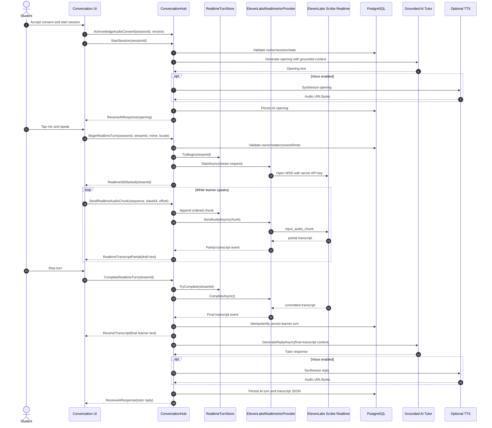

# ElevenLabs Realtime STT Production Implementation Plan

Date: 2026-05-14
Status: current architecture and rollout plan
Supersedes: `docs/ELEVENLABS-REALTIME-STT-IMPLEMENTATION-PLAN.md` where that document reflects historical planning assumptions
Linked artifacts: `docs/ELEVENLABS-REALTIME-STT-PRD.md`, `docs/ELEVENLABS-REALTIME-STT-PROGRESS.md`, `docs/CONVERSATION.md`

## Executive Summary

The OET platform already has the correct foundation for live AI speaking practice: a Next.js App Router learner UI, an ASP.NET Core backend, SignalR conversation sessions, server-side ASR/TTS provider selectors, encrypted admin settings, PostgreSQL persistence, grounded AI tutor replies, conversation evaluation, consent fields, and a mock-first realtime STT transport.

The recommended production architecture is **server-mediated ElevenLabs Scribe realtime STT as the canonical transcript path**. The learner browser streams audio chunks to the OET backend over SignalR; the backend validates the learner/session/consent, connects to ElevenLabs Scribe realtime WebSocket with server-held credentials, relays partial captions to the UI, and persists only backend-observed final transcript segments. The AI tutor, scoring, memory, evaluation, storage, quotas, audit, and rollback remain backend-authoritative.

ElevenLabs client-side single-use tokens are valid for future provisional captions, because current ElevenLabs docs support client-side `realtime_scribe` single-use tokens that expire after 15 minutes. They should not be the first canonical path here because browser-observed final transcripts are forgeable unless the backend also observes or verifies the provider stream.

Current production blockers are significant but bounded: PCM/container audio compatibility, real-provider protected smoke tests, hard spend metering and circuit breakers, production rollout gate changes, sponsor/school/minor privacy gates, observability and rollback runbooks, and a confirmed single-instance/sticky/distributed SignalR strategy.

## Current Project Analysis

### Detected Stack

- Frontend: Next.js App Router, React 19, TypeScript, Tailwind CSS 4, `motion/react`.
- Backend: ASP.NET Core Minimal API, SignalR, EF Core, PostgreSQL.
- Realtime transport: SignalR at `/v1/conversations/hub` with JWT access token factory.
- AI: backend grounded gateway via `ConversationAiOrchestrator`; conversation opening, reply, and evaluation are grounded and feature-coded.
- Audio: browser `MediaRecorder`, backend `IConversationAudioService`, content-addressed storage, retention worker.
- Deployment: Docker/standalone Next.js, ASP.NET API container, Nginx Proxy Manager, PostgreSQL, Electron, Capacitor.
- Tests: Vitest/React Testing Library, Playwright, backend .NET tests using SQLite where appropriate.

### Relevant Files And Modules

Frontend:

- `app/conversation/[sessionId]/page.tsx` - active live AI conversation page, SignalR connection, mic capture, realtime chunk streaming, batch fallback.
- `components/domain/conversation/ConversationPrepCard.tsx` - consent/readiness entry point.
- `components/domain/conversation/ConversationChatView.tsx` - committed turns, AI state, partial transcript display.
- `components/domain/conversation/ConversationMicControl.tsx` - mic/end controls and disabled reasons.
- `components/domain/conversation/ConversationTimerBar.tsx` - timer and connection/STT mode status.
- `lib/types/conversation.ts` - conversation session, turn, connection, partial transcript types.
- `hooks/usePronunciationRecorder.ts` and `lib/mobile/speaking-recorder.ts` - reusable microphone/mobile patterns for later extraction.

Backend:

- `backend/src/OetLearner.Api/Hubs/ConversationHub.cs` - SignalR session, audio, realtime turn lifecycle, AI reply trigger.
- `backend/src/OetLearner.Api/Services/Conversation/Asr/IConversationAsrProvider.cs` - batch and realtime ASR contracts.
- `backend/src/OetLearner.Api/Services/Conversation/Asr/ConversationAsrProviderSelector.cs` - provider selection and real-provider readiness gate.
- `backend/src/OetLearner.Api/Services/Conversation/Asr/ElevenLabsConversationRealtimeAsrProvider.cs` - experimental server-side ElevenLabs Scribe realtime WebSocket adapter.
- `backend/src/OetLearner.Api/Services/Conversation/ConversationRealtimeTurnStore.cs` - bounded in-memory stream/chunk/provider-session store.
- `backend/src/OetLearner.Api/Configuration/ConversationOptions.cs` - realtime STT flags, quotas, ElevenLabs STT settings, rollback mode.
- `backend/src/OetLearner.Api/Services/Conversation/ConversationOptionsProvider.cs` - DB/admin settings merge.
- `backend/src/OetLearner.Api/Domain/ConversationEntities.cs` - sessions, turns, idempotency/consent fields.
- `backend/src/OetLearner.Api/Endpoints/AdminEndpoints.cs` - admin conversation settings and validation.
- `scripts/deploy/validate-production-env.sh` - production guardrails for public ElevenLabs secrets and gated realtime rollout.

Docs/tests:

- `docs/ELEVENLABS-REALTIME-STT-PRD.md`
- `docs/ELEVENLABS-REALTIME-STT-PROGRESS.md`
- `backend/tests/OetLearner.Api.Tests/ConversationRealtimeSttTests.cs`
- `components/domain/conversation/conversation-realtime-controls.test.tsx`

### Current Architecture And Live Session Flow

1. Learner creates or resumes a conversation through `lib/api.ts` and the conversation REST endpoints.
2. `app/conversation/[sessionId]/page.tsx` hydrates scenario/turns and opens SignalR using `ensureFreshAccessToken()`.
3. The learner accepts versioned recording/vendor consent; `ConversationHub.AcknowledgeAudioConsent` persists consent timestamps and version.
4. `ConversationHub.StartSession` validates ownership, starts/resumes the session, generates a grounded AI opening, optionally synthesizes TTS, stores the AI turn, and emits `ReceiveAIResponse`.
5. On learner recording, the page calls `BeginRealtimeTurn` before microphone capture. The backend validates session, consent, feature flag, provider readiness, concurrency, timeouts, and MIME.
6. The browser records 1-second `MediaRecorder` chunks and sends them with `SendRealtimeAudioChunk`.
7. The backend stores bounded chunks, forwards to a realtime provider when attached, emits mock/provided partials, and can fall back to full-turn batch ASR when allowed.
8. On stop, `CompleteRealtimeTurn` commits a non-mock provider final transcript if available; otherwise it falls back to batch ASR over buffered audio when enabled.
9. `ProcessAudioTurnAsync` persists the learner turn/audio, rebuilds transcript JSON, calls the grounded AI tutor, optionally synthesizes TTS, stores the AI turn, and emits `ReceiveTranscript` and `ReceiveAIResponse`.
10. Session end queues the existing evaluation path.

### Existing Reusable Pieces

- SignalR learner-authenticated hub and reconnect lifecycle.
- Server-owned session, consent, audio, transcript, AI, evaluation, and TTS pipeline.
- Realtime ASR provider interfaces and mock provider.
- Experimental ElevenLabs Scribe realtime provider with host pinning, server API key, partial/committed event mapping, terminal provider-error cleanup, and PCM guard.
- Encrypted admin settings for distinct STT/TTS credentials.
- Idempotency fields on conversation turns.
- Production env guardrails rejecting `NEXT_PUBLIC_ELEVENLABS*`, backend STT API key envs, and ungated real-provider selection.

### Missing Pieces

- Device-matrix proof for PCM capture. Current frontend prefers browser `AudioWorklet` PCM 16 kHz mono chunks and keeps `MediaRecorder` as the fallback blob, but Safari/WebView/Electron/Capacitor still need real-device validation.
- Vendor usage reconciliation. The backend now fails closed unless estimated pricing is configured and checks per-user daily seconds plus projected monthly cost from persisted provider-backed turns before starting a real stream; imported ElevenLabs billing reconciliation remains open.
- Protected real-provider smoke execution. The manual workflow/test scaffold exists and is secret-gated as a connectivity smoke; it still needs protected environment setup, a rotated key, and deterministic speech fixture before it can prove transcript completion.
- Admin UI exposure for real provider credentials/selection after readiness gates pass.
- Hub-level integration tests for forced persistence exceptions, duplicate finals, fallback-disabled paths, and provider abort/dispose exception behavior.
- Full sponsor/school/minor privacy/legal policy ledger. The first enforcement slice denies real-provider use for managed learners unless learner consent and an explicit managed-learner flag are present, and denies real provider until adult-status policy is explicitly acknowledged.
- Staging proof for process-local active stream/provider-session state. The first rollout supports declared `single-instance` or `single-region-sticky` topology; distributed state is still future architecture.

### Risks And Blockers

- Real ElevenLabs Scribe cannot be broadly enabled until audio format compatibility is solved.
- Production rollout is intentionally blocked by admin/mock-only UI and env validation.
- Cost controls are not yet enforceable enough for broad beta.
- In-memory stream state needs sticky sessions or a distributed design before horizontal API scaling.
- Mobile Safari/WebView/Electron microphone and codec behavior need real-device QA.
- Student speech is sensitive; raw audio/transcripts must stay out of logs and raw realtime chunks should not be retained.

### Assumptions Needing Confirmation

- First production target remains AI Conversation plus Speaking self-practice deep-links, not native Speaking recorder or Pronunciation realtime scoring.
- Product accepts strict manual half-duplex for launch; barge-in/VAD can come later.
- Final audio retention remains 30 days unless school/sponsor/minor policy requires different retention.
- ElevenLabs account/vendor terms are approved for student speech in target markets.
- The production backend will either run single-instance for realtime sessions or support sticky SignalR routing until active stream state is distributed.

## Recommended ElevenLabs Architecture

### Option A - Client-Side Realtime STT

Browser captures microphone audio and connects directly to ElevenLabs using a backend-minted single-use `realtime_scribe` token. ElevenLabs returns partial and committed transcripts to the browser; the browser posts committed text to the backend.

| Dimension | Assessment |
| --- | --- |
| Latency | Lowest path for captions. |
| Security | API key can stay server-side, but the browser receives and controls transcript events. Final transcript trust is weak unless backend verifies. |
| Complexity | Lower backend streaming, higher frontend/provider SDK/device variability. |
| Deployment | Requires direct ElevenLabs WSS in browser CSP/connect-src and mobile WebView QA. |
| Compatibility | Good where ElevenLabs React/JS SDK and microphone APIs work; more fragile on iOS/Capacitor/Electron. |
| Suitability | Good for provisional captions; weak for canonical OET tutor/evaluation state. |
| Scalability/cost | Lower backend bandwidth, harder real-time policy enforcement. |
| Maintainability | Provider logic leaks into frontend unless tightly isolated. |

Verdict: defer as optional provisional-caption experiment only.

### Option B - Server-Mediated Realtime STT

Browser streams audio chunks to `ConversationHub`; backend validates access and opens ElevenLabs realtime WebSocket with server-held credentials. Backend relays partial captions and persists only backend-observed final transcripts.

| Dimension | Assessment |
| --- | --- |
| Latency | Slight extra hop; acceptable if chunks are small and backend/proxy are tuned. |
| Security | Strongest credential isolation and transcript authority. |
| Complexity | Highest backend orchestration, but aligns with existing SignalR/session pipeline. |
| Deployment | Fits ASP.NET Core containers; requires WSS/proxy timeout validation. |
| Compatibility | Browser talks only to OET backend; audio format remains the main issue. |
| Suitability | Best for live tutoring, scoring, persistence, and privacy controls. |
| Scalability/cost | Backend can enforce quotas, circuit breakers, budget caps, and rollback. |
| Maintainability | Best provider boundary; ElevenLabs stays behind backend interfaces. |

Verdict: recommended production path.

### Option C - Hybrid Architecture

Backend issues short-lived client tokens for direct ElevenLabs provisional captions, while backend separately receives audio/final commits for authoritative AI tutor state.

| Dimension | Assessment |
| --- | --- |
| Latency | Best captions with backend authority if carefully split. |
| Security | Acceptable only if browser transcript is explicitly non-canonical. |
| Complexity | Highest because two realtime paths must be operated. |
| Deployment | Needs direct ElevenLabs WSS and app SignalR paths. |
| Compatibility | Broadest QA matrix. |
| Suitability | Useful after latency measurements, not first rollout. |
| Scalability/cost | Can reduce backend audio bandwidth but complicates metering. |
| Maintainability | Viable only with strict adapter boundaries. |

Verdict: future optimization for captions only.

## Why Server-Mediated Is Best For Live AI Speaking Tutoring

- It never exposes permanent ElevenLabs credentials to the browser.
- It preserves backend authority for final transcripts, AI tutor replies, evaluation, scoring, storage, usage policy, and audit.
- It matches the existing Conversation architecture and mission-critical rulebook/AI gateway constraints.
- It supports UI partials while preventing partial text from driving grading or memory.
- It lets the backend enforce consent, entitlement, max duration, concurrency, rate limits, provider health, cost caps, and rollback.
- It keeps ElevenLabs STT, future TTS, and any future Conversational AI integration replaceable behind provider adapters.

## Target Architecture

```text
Learner browser / Electron / Capacitor
  - consent and microphone readiness
  - audio capture and chunking
  - live partial transcript UI
  - committed transcript and AI tutor UI
  - strict half-duplex controls
        |
        | SignalR with app JWT
        v
ASP.NET Core ConversationHub
  - learner/session/state/consent validation
  - realtime turn lifecycle
  - chunk sequencing and limits
  - fallback and reconnect policy
        |
        v
ConversationRealtimeTurnStore / future orchestrator
  - active stream state
  - provider session attachment
  - bounded buffers
  - idempotent completion
        |
        v
IConversationRealtimeAsrProvider
  - mock provider
  - ElevenLabsConversationRealtimeAsrProvider
  - future Azure/Deepgram realtime providers
        |
        | outbound WSS with server-held credential
        v
ElevenLabs Scribe Realtime
  - partial transcript events
  - committed transcript events
  - timestamps/language/provider metadata
        |
        v
Conversation turn commit path
  - persist final learner transcript/audio
  - rebuild TranscriptJson
  - trigger grounded AI tutor reply
        |
        v
ConversationAiOrchestrator + optional TTS
        |
        v
PostgreSQL + IFileStorage + telemetry
```

### Frontend Audio Layer

- Request microphone permission only after user action and current consent.
- Detect unsupported `navigator.mediaDevices`, `MediaRecorder`, Web Audio, and mobile WebView constraints.
- Capture with echo cancellation, noise suppression, auto gain, and mono where supported.
- Show `connecting`, `live`, `fallback`, `listening`, `transcribing`, `ai-thinking`, `ai-speaking`, `reconnecting`, `offline`, and `error` states.
- Render partial captions as draft/non-durable text; replace only when `ReceiveTranscript` arrives.
- Lock microphone during AI TTS playback and while a turn is committing.
- Fall back to batch `SendAudio` when realtime is disabled/unavailable and allowed.

### ElevenLabs STT Adapter

- Keep all ElevenLabs details in `ElevenLabsConversationRealtimeAsrProvider` and related provider interfaces.
- Support `StartAsync`, `SendAudioAsync`, `CompleteAsync`, `AbortAsync`, partial event mapping, final event mapping, terminal error handling, host pinning, logging redaction, keyterms, language, audio format, and commit strategy.
- Treat `scribe_v2_realtime` and `realtime_scribe` token support as provider-specific implementation details.
- Make future providers replaceable without changing the UI/session/AI layers.

### Backend Session Orchestrator

- Validate authenticated learner ownership on every lifecycle call.
- Require current recording/vendor consent before microphone capture and commit.
- Enforce one active realtime stream per user/session for launch.
- Persist only final committed transcript segments.
- Keep partial transcripts UI-only.
- Trigger AI tutor only after final learner turn commit.
- Clean up provider sessions on disconnect, cancellation, timeout, session end, and provider error.

### AI Tutor / Interlocutor Engine

- Reuse `ConversationAiOrchestrator` and grounded AI gateway.
- Feed only final learner utterances into AI replies/evaluation.
- Maintain roleplay/handover context via persisted turns and scenario JSON.
- Provide corrections/evaluation through grounded feedback, not constant interruption.
- Keep lesson/rubric/profession/country context inside existing rulebook/scoring contracts.

### Optional TTS Layer

- Keep TTS independent from STT provider selection.
- Display AI text as soon as available; play TTS when ready.
- Pause/stop tutor audio before learner recording starts.
- Reject or ignore learner audio outside learner-turn state to prevent feedback loops.

### Storage, Analytics, And Observability

Store final transcript segments, final audio references where required, timestamps, speaker role, provider/model/confidence metadata, session events, AI feedback, evaluation, and scoring data.

Do not store raw realtime chunks, raw provider payloads, API keys, single-use tokens, signed URLs, or raw transcript text in logs by default.

Track connection lifecycle, first-partial latency, final-commit latency, AI response latency, TTS latency, disconnects, fallback activations, duplicate commit rejects, provider errors, audio seconds, active streams, and budget consumption.

## Detailed Data Flow

1. Learner opens `/conversation/{sessionId}`.
2. UI resumes session and hydrates persisted turns.
3. Learner accepts current recording/vendor-processing consent.
4. UI starts SignalR connection and calls `StartSession`.
5. Backend validates owner/session and emits AI opening if needed.
6. Learner taps microphone.
7. UI calls `BeginRealtimeTurn(sessionId, streamId, mimeType, locale)` before microphone capture.
8. Backend validates authz, state, consent, quotas, provider readiness, and one-active-stream rule.
9. Backend starts ElevenLabs realtime session or returns fallback/denied.
10. Browser captures audio chunks and calls `SendRealtimeAudioChunk` in order.
11. Backend forwards chunks to ElevenLabs, tracks bounded buffers and provider session state.
12. ElevenLabs emits partial transcript; backend relays it to the caller as draft UI state.
13. Learner stops speaking; UI calls `CompleteRealtimeTurn`.
14. Backend completes provider stream, waits for committed transcript, and falls back to batch if configured and no real final exists.
15. Backend idempotently persists final learner turn and audio metadata.
16. Backend emits `ReceiveTranscript`.
17. Backend sends final learner utterance to grounded AI tutor.
18. Backend persists AI turn, optional TTS audio, and emits `ReceiveAIResponse`.
19. UI clears partial draft, shows committed learner/AI turns, and locks mic while AI audio plays.
20. End session queues existing evaluation.

## Mermaid Sequence Diagram



## Proposed File And Module Changes

### Backend

- `backend/src/OetLearner.Api/Services/Conversation/Asr/ElevenLabsConversationRealtimeAsrProvider.cs` - complete protocol spike, audio-format support, event schema validation, protected smoke learnings.
- `backend/src/OetLearner.Api/Hubs/ConversationHub.cs` - add spend checks, stronger idempotent duplicate-final handling, hub integration coverage hooks, optional orchestrator extraction.
- `backend/src/OetLearner.Api/Services/Conversation/ConversationRealtimeTurnStore.cs` - preserve bounded in-memory launch model; plan sticky/distributed state before scale-out.
- `backend/src/OetLearner.Api/Services/Conversation/ConversationRealtimeUsageMeter.cs` - new service for per-user seconds, global spend, reservations, rollback trigger.
- `backend/src/OetLearner.Api/Services/Conversation/ConversationTurnCommitService.cs` - optional extraction so batch and realtime share commit/AI reply logic.
- `backend/src/OetLearner.Api/Endpoints/ConversationEndpoints.cs` - optional token endpoint only if hybrid captions are enabled; keep media ownership checks.
- `backend/src/OetLearner.Api/Endpoints/AdminEndpoints.cs` and `backend/src/OetLearner.Api/Contracts/AdminRequests.cs` - expose real provider controls only after gates pass.
- `backend/src/OetLearner.Api/Configuration/ConversationOptions.cs` - keep current realtime/STT options; add any missing usage-meter provider fields.
- `scripts/deploy/validate-production-env.sh` - update gates only after protected smoke and metering land.

### Frontend

- `app/conversation/[sessionId]/page.tsx` - extract current inline orchestration into hooks/components after stability.
- `components/domain/conversation/ConversationPrepCard.tsx` - add device/readiness/mobile fallback copy.
- `components/domain/conversation/ConversationChatView.tsx` - render stable/unstable partial text distinctly and reduce screen-reader noise.
- `components/domain/conversation/ConversationMicControl.tsx` - improve `aria-describedby`, recovery actions, AI-audio lock state.
- `components/domain/conversation/ConversationTimerBar.tsx` - separate timer from live status announcements.
- `hooks/useConversationConnection.ts` - SignalR lifecycle/reconcile extraction.
- `hooks/useConversationRealtimeTranscription.ts` - realtime state machine extraction.
- `hooks/useConversationAudioCapture.ts` or `lib/audio/microphone.ts` - shared `MediaRecorder`/PCM capture helpers.
- `lib/elevenlabs/clientRealtimeStt.ts` - only for future optional hybrid token captions.
- `lib/types/conversation.ts` - keep/extend event/state/provider types.

### Suggested TypeScript Interfaces

```ts
export type TranscriptEventKind = 'partial' | 'final' | 'error';

export interface TranscriptEvent {
  id: string;
  sessionId: string;
  turnClientId: string;
  kind: TranscriptEventKind;
  text: string;
  createdAt: string;
  provider?: string;
  confidence?: number | null;
  words?: TranscriptWordTimestamp[];
}

export interface PartialTranscriptEvent extends TranscriptEvent {
  kind: 'partial';
  stableText?: string;
  unstableText?: string;
}

export interface FinalTranscriptEvent extends TranscriptEvent {
  kind: 'final';
  turnNumber: number;
  durationMs: number;
  audioUrl?: string | null;
  providerEventId?: string | null;
}

export interface TranscriptWordTimestamp {
  text: string;
  startMs: number;
  endMs: number;
  confidence?: number | null;
}

export type SpeakingSessionConnectionState =
  | 'idle'
  | 'connecting'
  | 'live'
  | 'listening'
  | 'transcribing'
  | 'ai-thinking'
  | 'ai-speaking'
  | 'reconnecting'
  | 'offline'
  | 'fallback'
  | 'error';

export interface SpeakingSessionState {
  sessionId: string;
  connectionState: SpeakingSessionConnectionState;
  activeTurnClientId: string | null;
  partialTranscript: PartialTranscriptEvent | null;
  canRecord: boolean;
  canEnd: boolean;
  error?: string | null;
}

export interface RealtimeSttProvider {
  startTranscription(config: SpeakingSessionConfig): Promise<void>;
  stopTranscription(): Promise<void>;
  reconnect(): Promise<void>;
  onPartialTranscript(handler: (event: PartialTranscriptEvent) => void): () => void;
  onFinalTranscript(handler: (event: FinalTranscriptEvent) => void): () => void;
  onError(handler: (error: RealtimeSttError) => void): () => void;
}

export interface AiTutorTurn {
  turnNumber: number;
  text: string;
  audioUrl?: string | null;
  emotionHint?: string | null;
  appliedRuleIds: string[];
  createdAt: string;
}

export interface SpeakingSessionConfig {
  sessionId: string;
  maxTurnMs: number;
  maxSessionSeconds: number;
  locale: string;
  audioFormat: 'webm-opus' | 'pcm-s16le-16khz' | 'mp4-aac';
  commitStrategy: 'manual' | 'vad' | 'hybrid';
  provider: 'mock' | 'elevenlabs-stt' | 'azure' | 'deepgram' | 'whisper';
  provisionalClientCaptionsEnabled: boolean;
}

export interface RealtimeSttError {
  code: string;
  message: string;
  retryable: boolean;
}
```

### Backend Interface Shape

Current backend contracts already exist in `IConversationAsrProvider.cs`; keep this shape and avoid a parallel abstraction unless an orchestrator extraction requires it:

```csharp
public interface IConversationRealtimeAsrProvider
{
    string Name { get; }
    bool IsConfigured { get; }

    Task<IConversationRealtimeAsrSession> StartAsync(
        ConversationRealtimeAsrStartRequest request,
        IConversationRealtimeTranscriptSink sink,
        CancellationToken ct);
}

public interface IConversationRealtimeAsrSession : IAsyncDisposable
{
    Task SendAudioAsync(ConversationRealtimeAudioChunk chunk, CancellationToken ct);
    Task CompleteAsync(CancellationToken ct);
    Task AbortAsync(string reason, CancellationToken ct);
}
```

## Environment Variables And Configuration

Prefer encrypted admin/provider storage for secrets. Do not put ElevenLabs STT keys in browser-visible config or committed env files.

Backend configuration:

```text
Conversation__RealtimeSttEnabled=false
Conversation__RealtimeAsrProvider=mock
Conversation__RealtimeSttAllowRealProvider=false
Conversation__RealtimeSttRealProviderProductionAuthorized=false
Conversation__RealtimeSttFallbackToBatch=true
Conversation__RealtimeSttMaxChunkBytes=262144
Conversation__RealtimeSttPartialMinIntervalMs=350
Conversation__RealtimeSttTurnIdleTimeoutSeconds=15
Conversation__RealtimeSttMaxConcurrentStreamsPerUser=1
Conversation__RealtimeSttMaxAudioSecondsPerSession=360
Conversation__RealtimeSttDailyAudioSecondsPerUser=3600
Conversation__RealtimeSttMonthlyBudgetCapUsd=25
Conversation__RealtimeSttConsentVersion=realtime-stt-v1-2026-05-14
Conversation__RealtimeSttRollbackMode=disable-conversation-audio
Conversation__ElevenLabsSttBaseUrl=https://api.elevenlabs.io/v1
Conversation__ElevenLabsSttModel=scribe_v2_realtime
Conversation__ElevenLabsSttLanguage=auto
Conversation__ElevenLabsSttAudioFormat=pcm_16000
Conversation__ElevenLabsSttCommitStrategy=manual
Conversation__ElevenLabsSttEnableProviderLogging=false
Conversation__ElevenLabsSttTokenTtlSeconds=900
```

Secret handling:

- Store `ElevenLabsSttApiKey` through encrypted admin/provider settings when possible.
- Keep production validation rejecting `NEXT_PUBLIC_ELEVENLABS*`.
- Keep production validation rejecting raw backend STT API key envs until an approved secret path and smoke exist.
- If hybrid mode is added, add only backend token-minting settings and a CSP/connect-src allowlist for ElevenLabs WSS under a feature flag.

## Exhaustive Pending Work Register

This register is the no-gaps backlog for production authorization. P0 items block any real ElevenLabs provider exposure outside protected smoke. P1 items block paid beta. P2/P3 items block broad rollout or expansion surfaces. The current owner-selected pilot cap is `$25/month`, and protected live smoke is mandatory before real-provider admin exposure or paid beta.

| ID | Priority | Surface | Pending work | Evidence required | No-go if missing |
| --- | --- | --- | --- | --- | --- |
| RTSTT-001 | P0 | Audio pipeline | Browser PCM worklet implemented for web route; complete device matrix for Chrome, Edge, Firefox, Safari, iOS Safari/WebView, Android WebView, Electron, Capacitor, CPU/battery, sample-rate conversion, and failure fallback. | Decision record, fixture tests, device matrix, provider-format proof. | No broad real-provider browser rollout without device proof. |
| RTSTT-002 | P0 | Provider smoke | Protected live ElevenLabs connectivity smoke scaffold exists: manual-only, secret-gated, protected-environment gated, synthetic non-student audio only. Execute after key rotation, then add deterministic speech audio to validate WSS auth, audio format, partial/final schema, close/error behavior, and usage movement. | Protected workflow/test run with no secret or transcript leakage and a final-transcript assertion before rollout evidence. | No real-provider admin exposure without successful final-transcript smoke evidence. |
| RTSTT-003 | P0 | Spend and quotas | First hard gate checks daily seconds and projected monthly cost before paid WSS starts. Complete durable reservations, release-on-cancel/failure, tenant/sponsor limits, vendor reconciliation, and auto-disable at cap. | Usage ledger/reconciliation, race tests. | No paid beta without durable reservations and vendor reconciliation. |
| RTSTT-004 | P0 | Circuit breaker | Add provider health policy for 401/403/429/5xx, websocket instability, final-missing rate, latency breach, fallback-only mode, and automatic rollback action. | Provider failure tests, admin-visible reason, alerts. | No beta if provider failures cannot force fallback-only. |
| RTSTT-005 | P0 | Transcript authority | Define final transcript authority for provider final vs batch fallback precedence, late finals after fallback, concurrent completes, DB unique-index races, learner correction policy, and one AI reply per committed final. | Hub/commit tests and `docs/CONVERSATION.md` update. | No beta if duplicate finals can create duplicate learner turns or AI replies. |
| RTSTT-006 | P0 | Scale-out topology | First topology gate implemented: non-mock providers require declared `single-instance`, `single-region-sticky`, or `distributed` plus region id. Complete staging proof for reconnect, rolling deploy, container recycle, provider-session cleanup, and sticky routing. | Deployment decision, staging proof, rollback behavior. | No multi-instance production beta. |
| RTSTT-007 | P0 | Privacy cohorts | First fail-closed gates implemented for adult-status acknowledgement and managed learners. Complete guardian/sponsor authority ledger before `BeginRealtimeTurn`, batch audio, token minting, and admin enablement across direct adult, sponsored adult, school-managed adult, and minor/guardian-required. | Policy matrix, server tests, privacy/legal approval. | No sponsor/school/minor rollout. |
| RTSTT-008 | P0 | Consent model | Split consent purposes if required: recording, vendor STT, optional TTS playback, retention, school/sponsor consent, provider identity, and policy text version. Invalidate consent on provider/retention/training-term changes. | Consent migration/tests and learner copy. | No real-provider launch if vendor-processing changes are indistinguishable. |
| RTSTT-009 | P1 | Orchestration boundary | Extract provider lifecycle, buffering, commit, fallback, usage metering, and AI reply trigger from `ConversationHub` into orchestrator/commit services once behavior is stable. | `ConversationRealtimeTurnOrchestrator`, commit service, focused tests. | Blocks maintainable paid beta if hub keeps owning every concern. |
| RTSTT-010 | P1 | State machines | Formalize client, hub stream, provider session, and persisted conversation state machines with terminal states and recovery rules. | TS/C# event/state docs and tests. | No broad rollout if recovery states remain implicit. |
| RTSTT-011 | P1 | Provider contract | Extend realtime event contracts for provider session id, vendor request id, stable/unstable partials, word timestamps, language, retryability, usage estimate, close reason, and sanitized error category. | `IConversationAsrProvider`/TS type updates and protocol tests. | No reconciliation or production observability. |
| RTSTT-012 | P1 | Persistent events | Add durable realtime session/event/usage data for audit, latency, cost reconciliation, provider failures, dashboards, and telemetry retention. | EF migration, retention decision, query tests. | No paid beta without audit and usage evidence. |
| RTSTT-013 | P1 | Admin controls | After gates pass, expose real-provider controls, encrypted STT key entry, clear/rotate secret UX, smoke status, provider health, budget status, rollback action, and non-secret audit. Backend must reject unsafe enablement even if UI is bypassed. | Admin endpoint/UI tests and audit evidence. | No operator-controlled real-provider enablement. |
| RTSTT-014 | P1 | Observability | Implement metrics, dashboards, alerts, redaction checks, and reason codes for starts, denials, partials, finals, latency, fallback, provider errors, active streams, audio seconds, and cost. | Dashboard/runbook, alert thresholds, smoke output. | No beta without dashboards and alerts. |
| RTSTT-015 | P1 | Rollback runbook | Write and drill disable realtime, fallback-only, disable conversation audio, drain/abort active streams, clear/rotate key, verify batch fallback, and notify affected users/admins. | Runbook and completed rollback drill. | No production enablement. |
| RTSTT-016 | P1 | Deployment and proxy | Document and verify Nginx Proxy Manager WebSocket settings, Upgrade/Connection forwarding, idle timeout, HTTPS forwarding, backend outbound WSS, staging/prod separation, and post-deploy realtime smoke. | Deployment docs and post-deploy checks. | No rollout if WSS/proxy behavior is unverified. |
| RTSTT-017 | P1 | Migration rollout | Add checklist for realtime STT/settings/consent/event tables: deploy ordering, singleton settings row, indexes, rollback/forward-fix stance, and post-deploy DB checks. | Migration checklist and post-deploy DB evidence. | No production rollout if DB state cannot be verified. |
| RTSTT-018 | P1 | Security tests | Add hub/provider tests for ownership, current consent, stale consent, fallback-disabled, duplicate finals, forced persistence exceptions, abort-throws-dispose, mock-final non-persistence, provider close/error, and log redaction. | Backend test suite and negative cases. | No paid beta without deterministic failure coverage. |
| RTSTT-019 | P1 | AI/TTS separation | Test no AI calls from partials, one reply per final, evaluation from persisted turns only, TTS key/STT key separation, TTS failure does not fail transcript commit, and mic lock during playback. | AI/TTS selector tests and UI tests. | No tutor launch path that bypasses grounded gateway or duplicates replies. |
| RTSTT-020 | P2 | Frontend extraction | Extract reusable SignalR, realtime transcription, microphone capture, PCM/worklet/transcoding, and recovery hooks from the route. | Hooks, page tests, unchanged behavior. | Blocks native expansion and long-term maintainability. |
| RTSTT-021 | P2 | UX/a11y | Add mic preflight, device picker, provisional/final distinction, saved confirmation, screen-reader throttling, recovery actions, autoplay-blocked state, single status announcer, mobile-safe layout, and concise trust copy. | Component/page tests and manual QA. | Blocks broad learner rollout. |
| RTSTT-022 | P2 | Device QA | Execute real-device matrix for Chrome, Edge, Firefox, Safari, iOS Safari, Android WebView, Electron, Capacitor, noisy rooms, long silence, denied permission, tab close, and network drop. | QA matrix with pass/fail notes. | No mobile/native expansion. |
| RTSTT-023 | P2 | Analytics allowlist | Define privacy-safe realtime analytics fields. Hash/remove identifiers where not needed and prohibit transcript text, audio URLs, tokens, signed URLs, provider payloads, and raw session ids. | Analytics tests/static checks. | No beta if analytics can collect sensitive speech artifacts. |
| RTSTT-024 | P2 | Deletion/export/retention | Cover conversation audio, transcripts, provider metadata, AI usage records, audit records, telemetry, backups, and audience-specific retention in account deletion/export and retention sweeps. | Delete/export/retention tests. | No school/sponsor rollout without data lifecycle proof. |
| RTSTT-025 | P2 | Fallback disclosure | Disclose fallback provider path in consent/readiness UI and store/audit which provider processed each final turn. Fallback-disabled paths fail closed. | UI copy, provider metadata, tests. | No launch if fallback changes privacy/cost posture silently. |
| RTSTT-026 | P2 | Native Speaking | Define native Speaking integration separately from Conversation deep-links: consent, attempt/submission model, expert review, correction policy, scoring authority, storage, retention, and realtime caption persistence. | Speaking plan/tests and native QA. | Blocks native Speaking realtime expansion. |
| RTSTT-027 | P2 | Pronunciation | Define Pronunciation realtime integration without bypassing pronunciation ASR selector, phoneme scoring, projected scoring, rulebook, AI feedback, or audio retention policy. | Pronunciation plan/tests. | Blocks Pronunciation realtime expansion. |
| RTSTT-028 | P2 | Client-token captions | Design optional hybrid/client token mode as non-canonical: token endpoint, session binding, TTL, CSP/mobile WSS, no local storage, server verification, and UI labeling as provisional captions. | Endpoint/client design and security review. | No client-direct ElevenLabs path. |
| RTSTT-029 | P3 | Keyterms governance | Define OET/profession keyterm source, limits, admin edit policy, validation, cost impact, and rollout by profession. | Keyterms governance docs/tests. | Needed before tuning Scribe keyterms broadly. |
| RTSTT-030 | P3 | Usage map/docs | Update ElevenLabs usage map, conversation docs, privacy docs, deployment docs, and support docs as each gate changes status. | Docs PR and support handoff. | No public rollout without accurate docs. |

## Dependency Order

Critical path for real-provider enablement:

```text
RTSTT-001 -> RTSTT-002 -> RTSTT-003 -> RTSTT-004 -> RTSTT-005
          -> RTSTT-006 -> RTSTT-014 -> RTSTT-015 -> RTSTT-016
          -> RTSTT-013 -> RTSTT-018/019 -> RTSTT-012/017
          -> RTSTT-021/022 -> RTSTT-007/008/024 -> RTSTT-030
```

Expansion path after Conversation is stable:

```text
RTSTT-020 -> RTSTT-026 -> RTSTT-027 -> RTSTT-028 -> RTSTT-029
```

Nothing should expose real-provider controls outside protected testing before RTSTT-001, RTSTT-002, RTSTT-003, RTSTT-004, and RTSTT-006 have passed.

## Readiness Gates

- G0 Mock-only foundation: realtime feature can run with mock/fallback only; migrations apply locally/staging; partials remain non-durable.
- G1 Audio compatibility: real ElevenLabs stream format is proven across target launch browsers and unsupported formats fail to batch before paid WSS opens.
- G2 Protected smoke: live provider smoke passes with secrets, approval, low duration, budget cap, fork protection, schema assertions, and no key/transcript leakage.
- G3 Safety controls: spend meter, reservations, circuit breaker, rollback, observability, and security tests pass.
- G4 Staging internal lab: staging real-provider session succeeds for named adult internal users on desktop Chrome/Edge and at least one mobile browser, with dashboards watched.
- G5 Production internal beta: production real provider enabled for named internal users only, low limits, fallback on, and operator on-call ready.
- G6 Direct learner beta: privacy approval, support runbook, budget cap, device QA, and rollback drill signed off.
- G7 Sponsor/school/minor: server-side cohort gates, consent/legal approval, retention policy, and tests are complete.
- G8 Native/mobile expansion: Electron/Capacitor/native Speaking/Pronunciation QA and module-specific scoring/storage contracts are complete.

## RACI And Approvals

- Accountable: Dr Faisal Maqsood.
- Responsible backend: SignalR hub, provider adapter, metering, persistence, AI/TTS boundaries, backend tests.
- Responsible frontend: learner realtime UX, accessibility, microphone/device flows, fallback UI, frontend tests.
- Responsible DevOps: protected smoke, env validation, deployment gates, observability, alerts, rollback runbook.
- Consulted security/privacy: vendor terms, DPA/subprocessors, consent, retention, logs/Sentry, school/minor gates.
- Consulted QA: browser/device matrix, Playwright smoke, protected provider smoke evidence, manual lab signoff.
- Consulted content/OET: keyterms, learner copy, transcript correction policy, speaking/pronunciation expansion.
- Informed support/admin: rollout state, incident steps, known fallbacks, privacy/support copy.

## Hard No-Go Criteria

- No real provider rollout if audio format compatibility is unresolved.
- No paid provider stream if hard spend metering, reservation, and auto-disable are not enforced.
- No sponsor/school/minor rollout without approved privacy/vendor policy and server-side cohort gates.
- No multi-instance production beta without sticky SignalR routing or distributed active-stream state.
- No protected smoke if it can run on forks, default CI, scheduled jobs, or without explicit budget acknowledgement.
- No rollout if logs, analytics, Sentry, workflow artifacts, or admin responses can contain raw audio, transcript text, provider payloads, keys, tokens, signed URLs, or unnecessary raw session identifiers.
- No admin real-provider enablement if backend validation does not enforce metering, smoke acknowledgement, privacy gate, and production rollout acknowledgement.
- No native/mobile expansion until real-device microphone, codec, WebSocket, and battery/CPU QA pass.
- No AI tutor launch path that can respond to partial transcripts or create duplicate replies for one learner final.

## Production Rollout Checklist

1. Apply migrations with realtime disabled and provider `mock`.
2. Verify production env validation rejects public ElevenLabs secrets, backend raw STT key envs, and ungated `elevenlabs*` provider selection.
3. Configure encrypted ElevenLabs STT key only in staging/admin settings after smoke and metering exist.
4. Run mock staging smoke.
5. Run protected real-provider smoke with synthetic audio and low budget cap.
6. Run internal adult learner lab session in staging with dashboards watched.
7. Confirm metrics, alerts, privacy logs, and rollback actions.
8. Enable production only for named internal users with fallback on and low caps.
9. Expand to limited direct adult learners only after privacy/support/QA signoff.
10. Expand to sponsors/schools/minors only after cohort gates and legal/privacy approval.
11. Expand to Electron/Capacitor/native Speaking/Pronunciation only after surface-specific exit criteria pass.

## Per-Surface Exit Criteria

- Conversation web: final transcripts are backend-observed only; partials never persist; one learner final creates one AI reply; fallback works; consent/current policy enforced; metrics visible.
- Speaking self-practice deep-links: use the Conversation-safe path; no separate provider shortcut; same consent and retention policy.
- Native Speaking recorder: realtime captions do not bypass attempt/submission/expert review/scoring; same storage/retention/consent model; device QA complete.
- Pronunciation: no scoring bypass; `IPronunciationAsrProviderSelector`, phoneme scoring, projected scoring, rulebook, and retention remain authoritative.
- Admin settings: secrets redacted; clear/rotate tested; real provider hidden/denied until gates pass; every enable/disable writes non-secret audit.
- Deployment: env validation, proxy/WSS checks, protected smoke, observability, rollback, and migration evidence pass.
- Sponsor/school/minor: explicit consent/legal/vendor/retention gates enforced server-side and covered by tests.
- Analytics/support/docs: no sensitive payload collection; usage map, privacy, support, and runbooks reflect actual behavior.

## Step-By-Step Implementation Milestones

### Milestone 1 - Discovery And Cleanup

Goal: lock the production-ready path from the current mock-first implementation.

Files likely affected: `docs/ELEVENLABS-REALTIME-STT-PROGRESS.md`, `docs/CONVERSATION.md`, `ElevenLabsConversationRealtimeAsrProvider.cs`, `app/conversation/[sessionId]/page.tsx`, `ConversationOptions.cs`.

Steps:

1. Verify ElevenLabs realtime endpoint, event schema, commit strategies, token flow, input audio formats, `enable_logging`, keyterms, and close/error contract against current docs.
2. Decide audio strategy: browser PCM capture/worklet, backend transcoding, or verified `other`/container streaming if ElevenLabs realtime supports it.
3. Confirm launch scope remains Conversation and Speaking self-practice deep-links.
4. Confirm partial transcripts are UI-only and not stored/evaluated.
5. Inventory dead/conflicting audio/session code before extraction.

Acceptance criteria: audio strategy chosen; progress ledger updated; no code path treats partials as durable; blockers list is current.

Risks: ElevenLabs docs/API shape changes; browser container support differs by platform.

Rollback: keep `RealtimeSttEnabled=false`, provider `mock`, and batch fallback.

### Milestone 2 - Backend Credential/Token Endpoint

Goal: centralize secure credential use without exposing permanent keys.

Files likely affected: `ConversationEndpoints.cs`, `ConversationOptionsProvider.cs`, `ConversationSettingsRow.cs`, `AdminEndpoints.cs`, `AdminRequests.cs`, `lib/api.ts`.

Steps:

1. Keep server-mediated WSS as canonical path using encrypted `ElevenLabsSttApiKey`.
2. Add a learner token endpoint only if hybrid client captions are enabled and ElevenLabs single-use tokens are sufficiently scoped.
3. Bind any token/preflight endpoint to learner ownership, session state, current consent, realtime flag, provider gate, TTL, and rate limit.
4. Return only ephemeral token/config; never return API key or provider secrets.
5. Add missing config/startup/admin validation and redacted errors.

Acceptance criteria: wrong learner/inactive session/stale consent/missing config are rejected; secrets are masked; admin secret changes are audited.

Risks: token endpoint becomes a credential oracle; token scope cannot be limited enough.

Rollback: disable token endpoint and continue server-mediated only.

### Milestone 3 - Frontend Realtime STT Prototype

Goal: make the learner realtime UI robust across mock, real, and fallback modes.

Files likely affected: `app/conversation/[sessionId]/page.tsx`, conversation components, `hooks/useConversationRealtimeTranscription.ts`, `hooks/useConversationAudioCapture.ts`, `lib/audio/microphone.ts`, `lib/types/conversation.ts`.

Steps:

1. Extract SignalR and audio capture from the route after current behavior is stable.
2. Add permission/device readiness states and actionable fallback copy.
3. Render partial stable/unstable captions separately from committed turns.
4. Keep strict half-duplex: mic disabled during AI thinking/speaking/commit.
5. Support fallback to batch `SendAudio` without data loss.

Acceptance criteria: mock partials render; final turns come only from server `ReceiveTranscript`; tracks are released; denied/unsupported states are clear; mobile layout holds.

Risks: Safari/WebView codec limitations; screen-reader noise from live captions.

Rollback: hide realtime UI and use normal recording mode.

### Milestone 4 - Session Integration

Goal: make final realtime transcript commits idempotent, durable, and session-safe.

Files likely affected: `ConversationHub.cs`, `ConversationRealtimeTurnStore.cs`, `ConversationTurnCommitService.cs`, `ConversationEntities.cs`, EF migrations/tests.

Steps:

1. Add or extract a shared commit service for batch and realtime final turns.
2. Make duplicate `TurnClientId`/provider event commits reconcile as `already-committed`, including DB unique-index races.
3. Persist final transcript/audio/provider metadata only once.
4. Clean up provider sessions and buffers on disconnect/cancel/error.
5. Keep resume/export/evaluation reading committed turns only.

Acceptance criteria: one final event creates one learner turn and one AI reply; duplicate commits do not duplicate AI; fallback path remains green.

Risks: races between completion, disconnect, and late provider finals.

Rollback: force realtime completion to batch fallback or fail closed.

### Milestone 5 - AI Tutor Loop

Goal: connect final STT utterances to the existing grounded tutor without interruption.

Files likely affected: `ConversationHub.cs`, `ConversationAiOrchestrator.cs`, commit service, conversation docs.

Steps:

1. Invoke AI only after final learner turn commit.
2. Preserve `AiFeatureCodes.ConversationReply` and `ConversationEvaluation` usage recording.
3. Keep prompt grounding and conversation rulebook/scoring paths unchanged.
4. Add turn-taking policy to avoid aggressive correction/interruption.
5. Display text before TTS if voice synthesis is slow.

Acceptance criteria: no AI call from partials; final transcript triggers one reply; evaluation uses persisted transcript only.

Risks: VAD/manual commit boundaries feel unnatural; duplicate replies after reconnect.

Rollback: disable realtime AI replies and keep batch turn submission.

### Milestone 6 - Reliability And UX Polish

Goal: handle weak networks, provider failures, device issues, and learner recovery.

Files likely affected: conversation components/hooks, `ConversationHub.cs`, `ConversationRealtimeTurnStore.cs`, `ConversationOptions.cs`, analytics/telemetry files.

Steps:

1. Add explicit reconnect/reconcile flow before allowing a new turn.
2. Add idle timeout, max turn duration, max session duration, and stale-stream sweep telemetry.
3. Add manual commit for launch; tune VAD later.
4. Add audio device selection only if QA proves need.
5. Add safe recovery states: retry, fallback, refresh/resume, end safely.

Acceptance criteria: no lost turns on provider failure; recording disabled during unsafe states; fallback remains usable.

Risks: Nginx/proxy WebSocket timeouts; in-memory streams across reconnects.

Rollback: set realtime disabled or fallback-only.

### Milestone 6A - Hard Usage, Spend Metering, And Circuit Breaker

Goal: prevent paid ElevenLabs realtime sessions from starting or continuing beyond configured learner, tenant, provider, or platform limits.

Files likely affected: `ConversationHub.cs`, proposed `ConversationRealtimeUsageMeter.cs`, `ConversationOptions.cs`, `ConversationEntities.cs`, `LearnerDbContext.cs`, admin settings, new migration, backend tests.

Steps:

1. Add a durable realtime STT usage ledger with session id, learner id, tenant/sponsor id when present, provider, model, reserved seconds, committed seconds, estimated cost, final reconciled cost, provider request/session id, status, and timestamps.
2. Implement atomic `ReserveAsync`, `CommitAsync`, `ReleaseAsync`, and `DisableProviderAsync` paths.
3. Reserve before opening any paid provider WebSocket; release on start failure, cancel, disconnect, provider start error, and fallback-before-paid-start.
4. Commit usage on finalization, timeout, or provider close.
5. Enforce per-turn, per-session, per-user daily, tenant/sponsor, and global monthly caps before provider start and during long streams.
6. Add provider 429/5xx and latency circuit breaker that switches realtime to fallback-only and records an operator-visible reason.
7. Reconcile vendor-reported usage where available and flag local/vendor drift above a defined threshold.
8. Alert at 50%, 80%, 95%, and 100% of the pilot cap; at 100%, automatically disable real provider usage.

Acceptance criteria: concurrent tabs cannot overspend the same remaining budget; simulated 100% cap disables new paid streams without redeploy; failed starts release reservations; provider 429/5xx switches to fallback-only; tests cover reservation races, release-on-error, monthly cap kill switch, and provider circuit breaker.

Risks: local estimates may drift from vendor billing; multi-instance reservation races can overspend without atomic database constraints.

Rollback: disable real provider and leave batch fallback enabled; preserve usage ledger for audit.

### Milestone 6B - Operational Observability, Topology, And Rollback

Goal: make realtime STT operable under production proxy, deploy, outage, and scale conditions.

Files likely affected: `DEPLOYMENT.md`, deployment scripts, `scripts/observability-smoke.sh`, `scripts/deploy/post-deploy-verify.sh`, admin settings, proposed runbook/dashboard docs, Docker compose files.

Steps:

1. Define metrics: `realtime_stt_started_total`, `realtime_stt_provider_start_failed_total`, `realtime_stt_partial_latency_ms`, `realtime_stt_final_latency_ms`, `realtime_stt_ai_reply_latency_ms`, `realtime_stt_fallback_total`, `realtime_stt_provider_error_total`, `realtime_stt_paid_seconds_total`, `realtime_stt_estimated_cost_usd`, `realtime_stt_active_streams`, and `realtime_stt_rollback_total`.
2. Define alert thresholds: provider errors > 5% over 10 minutes, p95 final latency > 2500 ms for 15 minutes, fallback rate > 20%, active stream saturation, spend >= 80% cap, any secret-leak detector hit, and WSS reachability failure.
3. Document Nginx Proxy Manager WebSocket and idle-timeout settings for `/v1/conversations/hub` and backend outbound `wss://api.elevenlabs.io`.
4. Use single API instance as the realtime beta topology; document sticky SignalR routing or distributed active stream/session state as post-beta scale-out work.
5. Add staging proof for reconnect, rolling deploy, container restart, and active stream cleanup under the single-instance beta topology.
6. Write rollback runbook: disable real provider, fallback-only, disable conversation audio, drain/abort active streams, clear/rotate STT key, verify batch fallback, and notify support/admins.

Acceptance criteria: dashboards and alerts exist before beta; selected topology has staging evidence; rollback drill completes without production VPS volume/database destructive actions; active streams drain or abort safely during rollback.

Risks: process-local stream state can orphan paid provider sessions during restarts; proxy idle timeouts can silently kill sessions.

Rollback: revert to batch-only Conversation audio and keep realtime disabled until topology/proxy evidence is fixed.

### Milestone 7 - Security, Privacy, And Compliance Review

Goal: approve the feature for student speech before beta.

Files likely affected: `app/(auth)/privacy/page.tsx`, `docs/CONVERSATION.md`, `docs/ELEVENLABS-USAGE-MAP.md`, hub/endpoints/admin/settings, retention worker.

Steps:

1. Confirm no permanent key, token, raw transcript, raw provider payload, or signed URL leaks to client/logs/Sentry.
2. Confirm consent text and version match actual vendor processing/retention.
3. Split consent purposes where required: recording, ElevenLabs STT processing, optional TTS playback, retention, school/sponsor consent, provider identity, and policy text version.
4. Confirm raw realtime chunks are not retained.
5. Confirm final audio retention, deletion, account export/deletion behavior, backup retention, AI usage records, audit records, and telemetry retention.
6. Add sponsor/school/minor server-side policy gates before `BeginRealtimeTurn`, batch audio submission, optional token minting, and admin enablement.
7. Deny real-provider realtime STT unless the learner or managing organization has approved current vendor-processing consent, retention policy, and subprocessor terms.
8. Confirm DPA, subprocessors, retention/training use, international transfer, and HIPAA/BAA posture if relevant.
9. Define analytics allowlist and prohibit transcript text, audio URLs, tokens, signed URLs, provider payloads, and unnecessary raw session ids.

Acceptance criteria: no high/critical security findings; privacy docs updated; school/minor rollout gated; tests cover direct adult allowed, sponsor without approval denied, school without approval denied, minor without guardian/school consent denied, stale consent denied, and admin cannot override tenant/minor gate accidentally.

Risks: provider retention terms not sufficient; debug logs expose payloads.

Rollback: disable provider, clear encrypted key, rotate key, switch to mock/batch.

### Milestone 8 - Testing

Goal: prove deterministic behavior before real-provider rollout.

Files likely affected: `ConversationRealtimeSttTests.cs`, new hub/security tests, conversation component tests, Playwright smoke, deployment scripts.

Steps:

1. Unit test provider event parsing, host pinning, audio-format rejection/support, error cleanup, no-secret logging.
2. Hub tests for ownership, consent, duplicate finals, fallback-disabled, disconnect cleanup, abort/dispose exception paths.
3. Frontend tests for partial/final separation, mic denial, AI audio lock, reconnect, fallback, end-session blocking.
4. Playwright smoke for protected conversation route with mock realtime.
5. Protected ElevenLabs smoke with opt-in secrets, fork protection, low cap, and hard skip by default.
6. Page-level SignalR/MediaRecorder tests for hub readiness, server-denied realtime start, permission denial, retryable mic errors, `committing`, reconnect, and final transcript replacement.
7. Admin tests for realtime setting validation, warning copy, secret masking, clear-secret, smoke status, and rollback controls.
8. Privacy/security tests for cohort gates, analytics allowlist, consent version/provider changes, account export/deletion, and retention sweeps.
9. Offline provider protocol fixture tests for malformed JSON, unknown event types, multiple final events, auth failure, 429/5xx, close codes, partial/final ordering, and timestamp/word payload shapes.

Acceptance criteria: focused backend/UI tests pass; `npx tsc --noEmit`, `npm run lint`, `npm run backend:build` pass; protected smoke cannot run accidentally; failure-mode tests prove safe fallback or fail-closed behavior.

Risks: real provider smoke flakiness/cost; media mocks miss device bugs.

Rollback: keep real-provider smoke opt-in and feature off.

### Milestone 9 - Production Rollout

Goal: enable safely with monitoring, fallbacks, and instant rollback.

Files likely affected: admin settings UI/API, deployment validation, runbooks, docs.

Steps:

1. Deploy with realtime off and mock/fallback safe defaults.
2. Apply EF migrations through normal deployment flow.
3. Configure encrypted ElevenLabs STT key in staging/admin settings.
4. Run mock staging, then real-provider lab smoke, then internal adult learner beta.
5. Enable production with low per-user/session limits, fallback on, hard budget cap, and monitoring.
6. Expand to limited beta, direct learners, sponsors/schools, minors only as gates pass.
7. Document operator runbook: enable, verify, monitor, fallback-only, disable, rotate key.

Acceptance criteria: operators can disable without redeploy; fallback works; dashboards show starts/partials/finals/failures/cost; no production Docker volume changes are required.

Risks: provider outage/cost spike/mobile failure/privacy gate failure.

Rollback: set realtime off, provider mock, fallback/batch only, clear encrypted key if needed.

## Testing Strategy

- Backend unit/integration: provider selector, real-provider gate, base URL pinning, audio format, provider errors, final event parsing, consent, ownership, duplicate finals, fallback-disabled, disconnect cleanup, usage metering.
- Frontend Vitest/RTL: permission states, partial transcript draft, final transcript replacement, mic lock during AI audio, reconnect/offline, fallback copy, screen-reader live region behavior.
- Playwright: unauth/protected route behavior, mock realtime happy path, fallback path, no failed client responses on route load.
- Protected live smoke: opt-in only, validates ElevenLabs WSS auth, event schema, billing behavior, close/error handling, and no key leakage.
- Manual/device QA: Chrome, Edge, Firefox, Safari, iOS Safari, Android Chrome/WebView, Electron, Capacitor; noisy room; accent samples; denied permissions; network drops; long silence; tutor audio feedback.

Validation ladder:

```powershell
npx tsc --noEmit
npm run lint
npx vitest run components/domain/conversation/conversation-realtime-controls.test.tsx
dotnet test backend/OetLearner.sln --filter "FullyQualifiedName~ConversationRealtimeSttTests|FullyQualifiedName~AiVoiceProviderSeederTests"
npm run backend:build
npm run test:e2e:smoke
```

## Security And Privacy Checklist

- [ ] Permanent ElevenLabs API key is backend-only.
- [ ] No `NEXT_PUBLIC_ELEVENLABS*` secret exists.
- [ ] Optional client tokens are single-use, short-lived, session-bound, and never stored in local/session storage.
- [ ] Hub/token/preflight endpoints validate learner ownership, session state, and current consent.
- [ ] Partial transcripts are UI-only.
- [ ] Final transcripts are backend-observed before persistence.
- [ ] Raw realtime chunks are not stored by default.
- [ ] Stored audio uses `IConversationAudioService` and retention worker.
- [ ] Provider error bodies are redacted.
- [ ] Logs/Sentry/analytics do not contain raw speech, transcript text, keys, tokens, or signed URLs.
- [ ] Admin secret updates are audited without secret values.
- [ ] Rate limits, concurrency caps, duration caps, and spend caps are enforced.
- [ ] Sponsor/school/minor policy gates exist before broad rollout.
- [ ] Vendor retention/training/DPA/subprocessor posture is approved.

## Cost And Latency Considerations

Required production cost controls:

- One active realtime stream per user for launch.
- Max turn duration and max session duration.
- Daily/rolling audio seconds per learner/tier.
- Monthly provider budget cap with automatic disable/fallback-only rollback.
- Provider 429/5xx circuit breaker.
- No paid stream before auth/session/consent/quota checks pass.
- Stop streams on tab close, disconnect, timeout, cancel, or session end.

Latency targets:

- Mic start to first chunk: p50 under 250 ms.
- Chunk to first partial: p50 under 500 ms, p95 under 1500 ms.
- Stop/manual commit to final transcript: p50 under 1000 ms, p95 under 2500 ms.
- Final transcript to AI text: p50 under 3000 ms, p95 under 7000 ms.
- AI text to TTS audio: text must show first if TTS is slow.

## Risk Analysis

| Risk | Severity | Likelihood | Mitigation | Test / validation |
| --- | --- | --- | --- | --- |
| API key exposure | Critical | Medium | Backend-only encrypted secret, no public env, no direct key in browser. | Static scans, endpoint tests, production env validation. |
| Student privacy | Critical | High | Consent, DPA review, log redaction, tenant/minor gates. | Privacy review, log/Sentry inspection, disabled tenant tests. |
| Raw audio retention | High | Medium | Do not persist realtime chunks; final audio only through storage service/retention. | Retention and failure cleanup tests. |
| Latency too high | High | Medium | Measure stages, small chunks, text before TTS, fallback. | Staging latency metrics and device QA. |
| Mic permission failures | Medium | High | Readiness UI, clear recovery, fallback. | Browser permission mocks and manual QA. |
| Mobile audio issues | High | High | Feature detection, PCM/transcoding decision, native fallback. | iOS/Android WebView/Capacitor matrix. |
| WebSocket disconnects | High | Medium | Reconnect/reconcile, provider cleanup, idempotent final commits. | Network drop tests. |
| Duplicate transcript commits | High | Medium | `turnClientId`, provider event id, unique indexes, race handling. | Duplicate final integration tests. |
| AI responds before student finishes | High | Medium | Manual commit first; never feed partials to AI; VAD later. | Assert no AI call before final. |
| Tutor audio captured by mic | High | High | Strict half-duplex, stop playback before recording, server state checks. | UI state tests and browser QA. |
| Cost spikes | High | Medium | Quotas, reservations, budget cap, circuit breaker. | Abuse/parallel tab tests and metering tests. |
| Rate limits | Medium | Medium | Backoff/circuit breaker/fallback. | Simulated 429/5xx provider errors. |
| Inaccurate transcription | Medium | High | Keyterms, language hints, confidence, retry/correction, classroom guidance. | Accent/noise sample QA. |
| Lack of observability | High | Medium | Metrics for starts, partials, finals, latency, failures, cost. | Dashboard/smoke verification. |
| Serverless/persistent connection limits | High | Medium | Keep mediation in ASP.NET/SignalR containers; sticky sessions/backplane plan. | Proxy idle and scale-out review. |

## Open Questions

1. Which audio strategy is approved: browser PCM capture, backend transcoding, or verified ElevenLabs container streaming?
2. Should final learner audio remain retained for 30 days for all audiences, including sponsors/schools/minors?
3. Are minors or school-managed learners in scope for first beta?
4. Does the ElevenLabs account have approved student-speech retention/training terms?
5. What evidence confirms production realtime beta is constrained to one API instance, and what trigger moves sticky/distributed topology into scope?
6. Should learners be allowed to correct a misheard final transcript before AI evaluation?
7. What exact budget threshold and operator notification should auto-disable real provider usage?
8. Is direct client-token captioning worth a later experiment after server-mediated latency is measured?
9. What OET profession/keyterm set should be passed to Scribe at launch?
10. Is barge-in ever desired, or is strict half-duplex a permanent product rule?

## Final Recommended Next Action

Run a focused **audio-format and protected-smoke readiness spike** before any further broad implementation:

1. Confirm ElevenLabs Scribe realtime accepts either raw `pcm_16000` or a browser/mobile-compatible stream format in the actual account/environment.
2. Choose browser PCM capture vs backend transcoding.
3. Add a protected real-provider smoke that is opt-in, secret-gated, fork-safe, and budget-capped.
4. Implement hard usage/spend metering before exposing real provider controls outside internal testing.

Until those four items pass, keep production on mock/fallback/batch mode and keep real ElevenLabs realtime STT behind `RealtimeSttAllowRealProvider=false` and `RealtimeSttRealProviderProductionAuthorized=false`.
