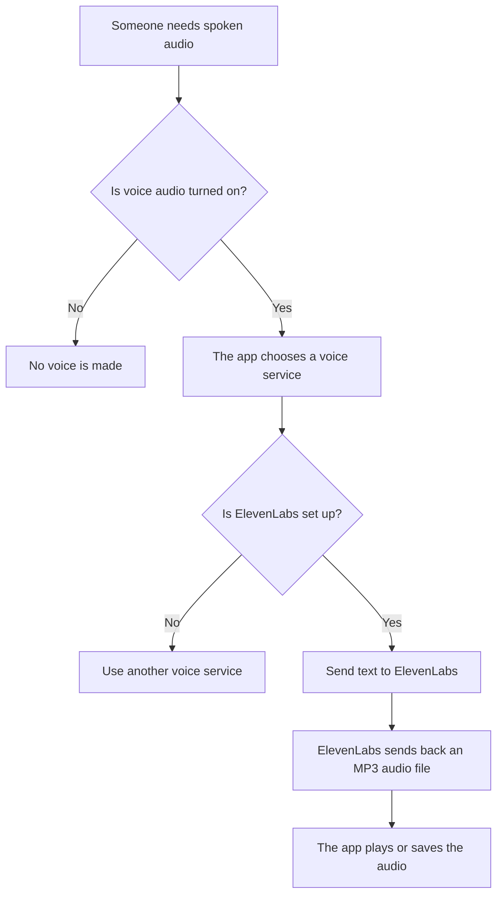
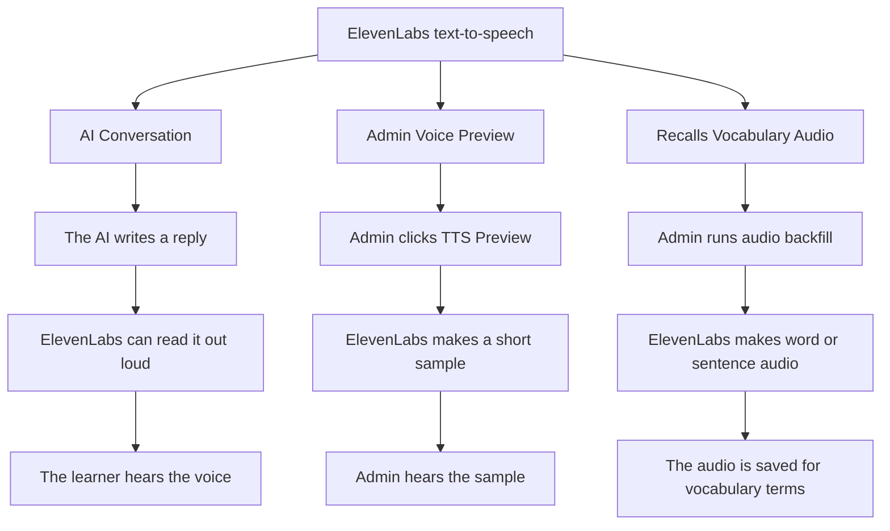
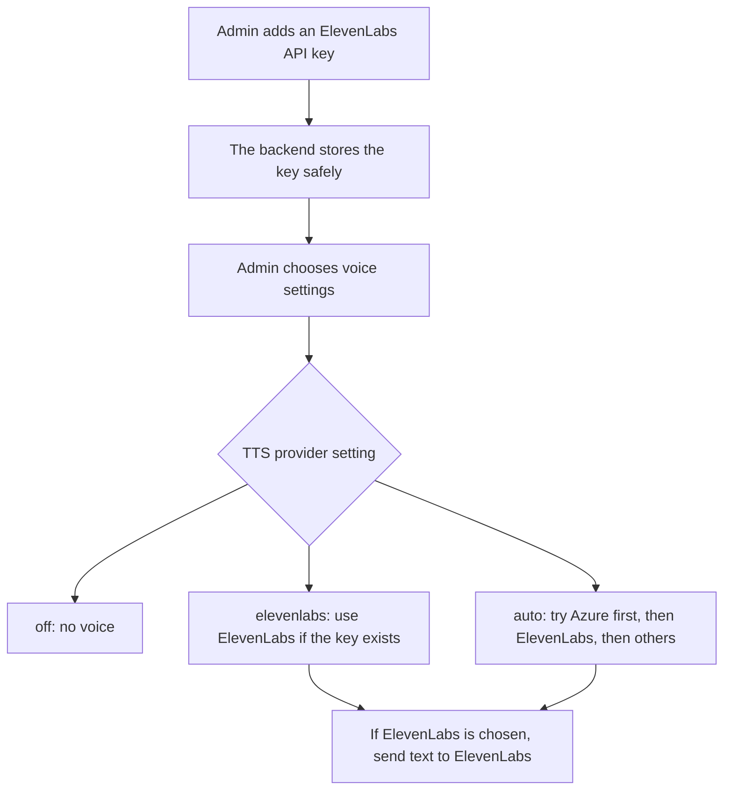
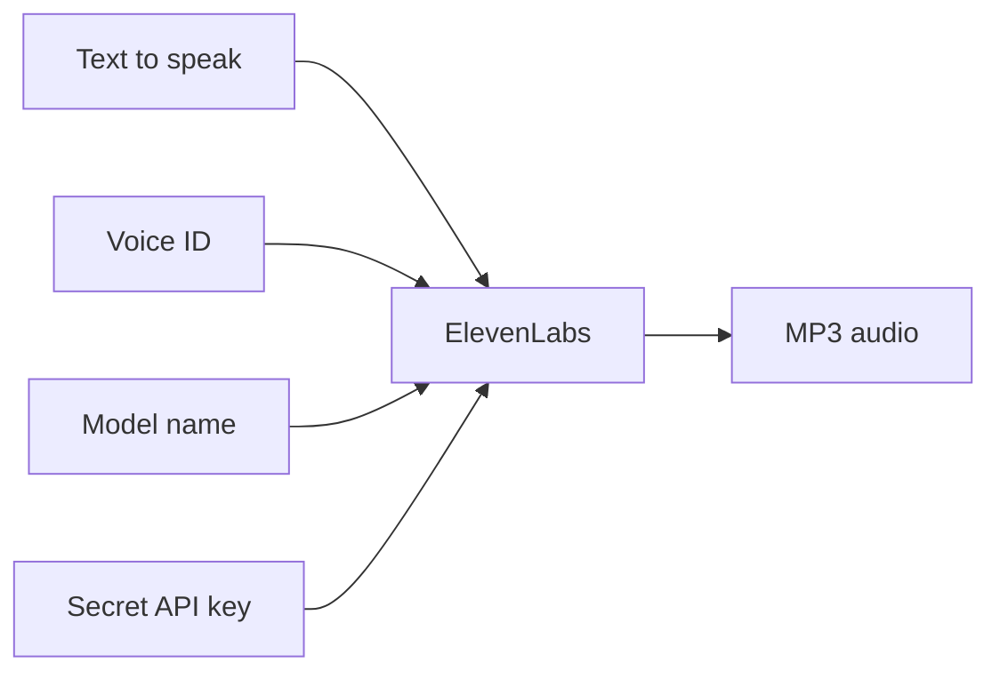
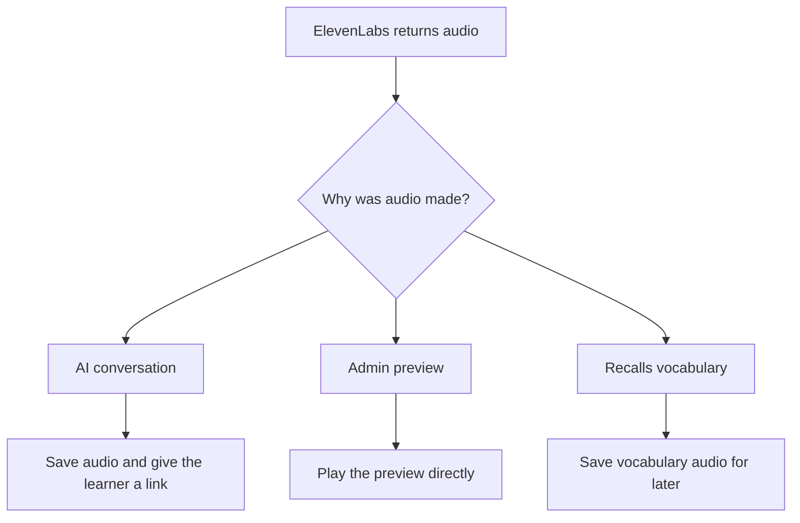

# ElevenLabs Usage Map - Plain English

This page explains where ElevenLabs is used in this project.

Short answer: ElevenLabs is used to turn text into spoken audio today. Realtime speech-to-text support is now being added behind feature flags as a server-mediated Conversation/Speaking/Pronunciation capability. ElevenLabs is not used to write answers, mark tests, or calculate scores.

## 1. Big Picture



## 2. Where ElevenLabs Can Be Used



## 3. How The App Decides To Use ElevenLabs



## 4. What Gets Sent To ElevenLabs



In plain words, the backend sends ElevenLabs the text, the chosen voice, the model name, and the secret key. ElevenLabs sends back an MP3 audio file.

## 5. What Happens To The Audio



## 6. Easy Summary

| Question | Easy answer |
| --- | --- |
| What is ElevenLabs used for? | Making spoken audio from text today; realtime speech-to-text is being added behind admin controls. |
| Is it used for AI answers? | No. The AI answer is made somewhere else. ElevenLabs only reads text out loud. |
| Is it used for speech-to-text? | Planned/behind flags. Realtime STT uses separate `elevenlabs-stt` settings and final transcripts remain backend-authoritative. |
| Is it used for scoring? | No. It does not mark tests or calculate scores. |
| Where can users hear it? | In AI Conversation audio, if ElevenLabs is selected and configured. |
| Where can admins test it? | In the admin TTS Preview button. |
| Where else can it create audio? | In Recalls vocabulary audio backfill. |
| Is there an ElevenLabs SDK package? | No. The backend calls ElevenLabs directly with HTTP. |

## 7. Exact Code Places

These are the main code areas, written in plain language.

| Area | What it does | File |
| --- | --- | --- |
| ElevenLabs caller | Sends text to ElevenLabs and gets MP3 audio back. | `backend/src/OetLearner.Api/Services/Conversation/Tts/ElevenLabsConversationTtsProvider.cs` |
| Voice chooser | Decides whether to use ElevenLabs, Azure, another service, mock, or no voice. | `backend/src/OetLearner.Api/Services/Conversation/Tts/ConversationTtsProviderSelector.cs` |
| Conversation use | Uses the chosen voice service for AI conversation opening and replies. | `backend/src/OetLearner.Api/Hubs/ConversationHub.cs` |
| Admin settings API | Saves ElevenLabs key, model, and voice settings. | `backend/src/OetLearner.Api/Endpoints/AdminEndpoints.cs` |
| Admin settings page | Lets admin choose ElevenLabs and enter its key, voice, and model. | `app/admin/content/conversation/settings/page.tsx` |
| Admin preview | Lets admin make a short voice sample. | `backend/src/OetLearner.Api/Endpoints/AdminEndpoints.cs` |
| Recalls audio | Uses the same voice system to make vocabulary audio. | `backend/src/OetLearner.Api/Services/Recalls/RecallsTtsService.cs` |
| Audio storage | Saves conversation audio files safely. | `backend/src/OetLearner.Api/Services/Conversation/ConversationAudioService.cs` |
| Provider list | Names ElevenLabs as a text-to-speech provider. | `backend/src/OetLearner.Api/Domain/AiProviderEntities.cs` |
| Seeder test | Tests that ElevenLabs can be added to the provider list. | `backend/tests/OetLearner.Api.Tests/AiVoiceProviderSeederTests.cs` |
| Realtime STT plan | Tracks server-mediated ElevenLabs Scribe implementation. | `docs/ELEVENLABS-REALTIME-STT-PRD.md` |
| Realtime STT progress | Tracks what is complete and what remains. | `docs/ELEVENLABS-REALTIME-STT-PROGRESS.md` |

## 8. Important Note About The API Key

The code uses this setting name:

```text
Conversation:ElevenLabsApiKey
```

For an environment variable in ASP.NET Core, that usually becomes:

```text
Conversation__ElevenLabsApiKey
```

The docs mention `ELEVENLABS_API_KEY`, but I did not find code that reads that exact name.

Realtime STT uses separate admin/provider settings such as `ElevenLabsSttApiKey`, `ElevenLabsSttModel`, and `RealtimeSttEnabled`. Do not expose any ElevenLabs key through `NEXT_PUBLIC_*` variables or browser responses.
