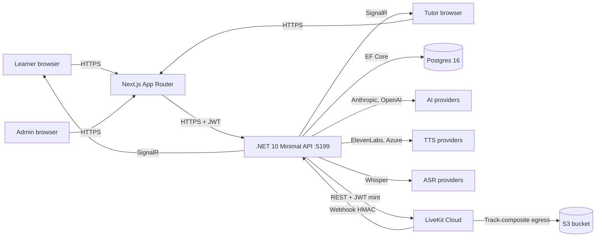
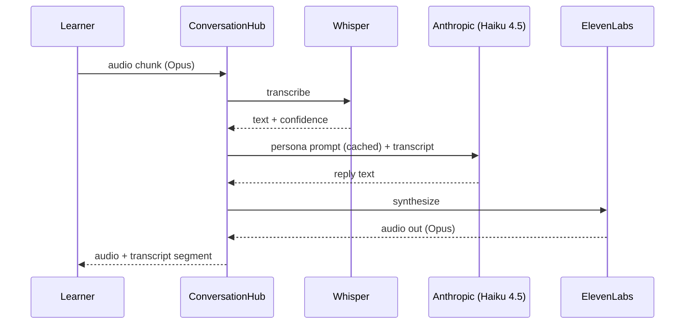
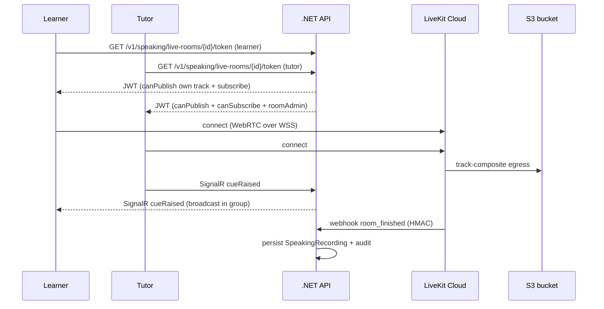

# Speaking Module — Architecture

## System context

## Module ownership map

| Surface | Routes | Owning service |
|---------|--------|----------------|
| Learner pages | `app/speaking/**` | speaking-team |
| Expert pages | `app/expert/speaking/**`, `app/expert/calibration/**` | speaking-team, tutor-ops |
| Admin content | `app/admin/content/speaking/**` | speaking-team, content-team |
| Admin analytics | `app/admin/analytics/speaking/**`, `app/admin/analytics/mocks/**` | speaking-team, analytics-team |

## Backend layout

- **Domain**: `backend/src/OetLearner.Api/Domain/Speaking*.cs`, `RolePlayCard*.cs`, `Interlocutor*.cs`, `PrivateSpeaking*.cs`.
- **Services**: `backend/src/OetLearner.Api/Services/Speaking/*` (18 services + retention worker).
- **Endpoints**: `backend/src/OetLearner.Api/Endpoints/*Speaking*.cs` + `TutorSpeakingEndpoints.cs` + `AdminSpeakingContentEndpoints.cs`.
- **Hubs**: `ConversationHub.SpeakingRoleplay.cs`, `SpeakingLiveRoomHub.cs`.
- **AI gateway**: `Services/Rulebook/AiGatewayService.cs` (provider routing); `Services/Rulebook/AiProviderRegistry.cs` (Anthropic, OpenAI-compatible, Cloudflare).

## Frontend layout

- **Pages**: `app/speaking/**` (learner), `app/expert/speaking/**` (tutor), `app/admin/content/speaking/**` (content), `app/admin/private-speaking/**` (commercial).
- **Components**: `components/domain/speaking/**` (~15 shared components).
- **API clients**: `lib/api/speaking-*.ts` (9 typed clients).
- **Analytics catalog**: `lib/analytics/speaking-events.ts`.

## Real-time flow (AI self-practice turn)

## Live tutor flow (LiveKit)

## Mock orchestrator state machine

See [state-machines.md](state-machines.md). Summary: `Prep1 → Active1 → Finished1 → Bridge → Prep2 → Active2 → Finished2 → Aggregated`.

## Trust boundaries

- Browser ↔ BFF: TLS, CSRF, session cookie.
- BFF ↔ API: TLS + bearer JWT.
- API ↔ AI / TTS / ASR providers: TLS + provider key (server-side only, never exposed to client).
- API ↔ LiveKit: TLS + signed JWT.
- LiveKit ↔ S3: AWS SigV4.

## Failure modes

- **AI provider 5xx** → secondary provider via `AiFeatureRouteResolver`; `Features__SpeakingV2_AssessmentEnabled = false` is the kill switch.
- **LiveKit outage** → `Features__PrivateSpeakingBookingsEnabled = false`; reschedule bookings.
- **Postgres degraded** → `503` from API; client retry-after.
- **S3 egress failure** → `SpeakingRecording.IsArchived = false`; retry queue.

See [SLA](sla.md) and [incident runbook](incident-runbook.md) for budgets and response.
