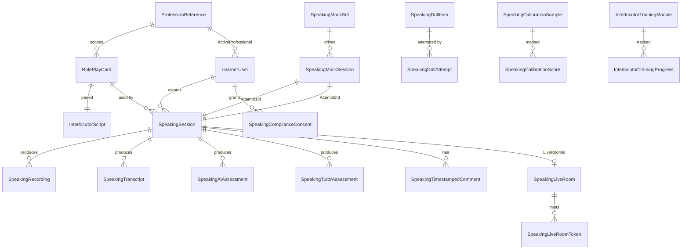

# Speaking Module — Data Model

## Entity quick-reference

| Entity | Purpose |
|--------|---------|
| `RolePlayCard` | Profession-specific scenario template (candidate-facing). |
| `InterlocutorScript` | Hidden patient persona for the same scenario. 1:1 with RolePlayCard. |
| `SpeakingSession` | Unified attempt row for AI self-practice, AI exam, and live tutor modes. |
| `SpeakingRecording` | Audio (and/or video) capture for a session. SHA-256 + retention. |
| `SpeakingTranscript` | ASR output with timestamped segments. `IsLatest` marks current. |
| `SpeakingAiAssessment` | Advisory AI scoring with evidence quotes. `IsAdvisory = true`. |
| `SpeakingTutorAssessment` | Authoritative tutor scoring. `IsFinal` flips on submit. |
| `SpeakingTimestampedComment` | Inline transcript comments (AI or tutor). |
| `SpeakingMockSet` | Curatorial pairing of two role-plays. |
| `SpeakingMockSession` | Learner's attempt at a mock set (two role-plays). |
| `SpeakingLiveRoom` | LiveKit-powered 1:1 tutor session room. |
| `SpeakingLiveRoomToken` | Short-lived per-participant JWT. |
| `SpeakingComplianceConsent` | Versioned consent audit trail. |
| `SpeakingDrillItem` | Single-criterion micro-practice item. |
| `SpeakingDrillAttempt` | Learner attempt at a drill. |
| `SpeakingCalibrationSample` | Gold-marked session for tutor calibration. |
| `SpeakingCalibrationScore` | Tutor's score on a calibration sample. |
| `SpeakingSharedResource` | Warm-up questions, listening samples, criteria PDFs. |
| `InterlocutorTrainingModule` | Training unit for tutors. |
| `InterlocutorTrainingProgress` | Tutor progress per module. |

## Indexes (key)

- `SpeakingSession (UserId, State, CreatedAt DESC)`
- `SpeakingRecording (SpeakingSessionId)` + `(RetentionExpiresAt) WHERE IsArchived = false`
- `SpeakingTranscript (SpeakingSessionId, IsLatest) WHERE IsLatest = true`
- `RolePlayCard (ProfessionId, Status, Difficulty)`
- `SpeakingLiveRoom (BookingId)`, `(LiveKitRoomSid)` unique
- `InterlocutorScript (RolePlayCardId)` unique

## Foreign-key rules

- Cascade delete from `LearnerUser` → `SpeakingSession` only during account erasure (out-of-band, via service, not raw cascade).
- `InterlocutorScript` deletion blocked while paired `RolePlayCard` is Published.
- `SpeakingRecording` soft-delete (`IsArchived = true`) before physical purge.
