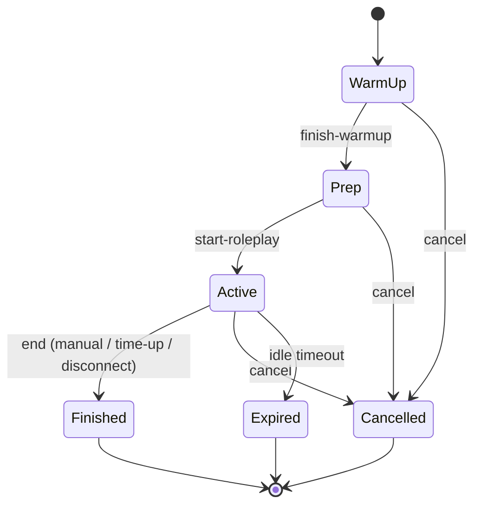
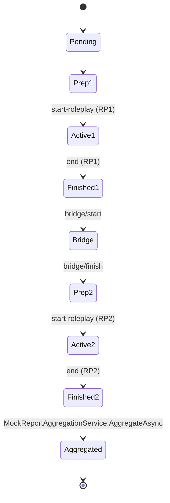
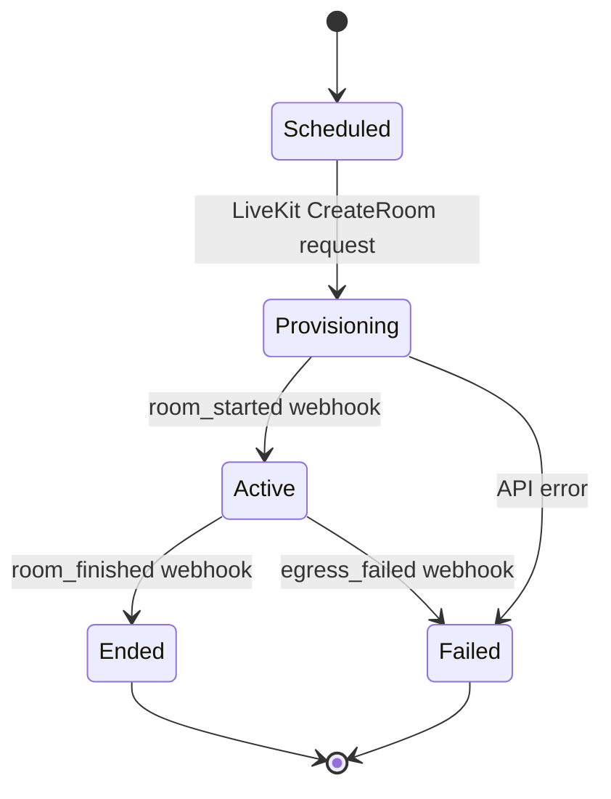

# Speaking Module — State Machines

## `SpeakingSession`

Guarded transitions: any skip (e.g. WarmUp → Active) throws `ApiException("invalid_state_transition")`. Verified by `SpeakingStateMachineGuardsTests`.

## `SpeakingMockSession`

Aggregation averages the two `SpeakingAiAssessment` rows into the combined readiness band.

## `SpeakingLiveRoom`

Webhook events are append-only into `SpeakingLiveRoom.WebhookEventsJson` with HMAC verification.

## Cancellation rules

- Cancellation allowed from any non-terminal state. Audit row written.
- Recording (if any partial chunks exist) is preserved or purged based on consent state.
