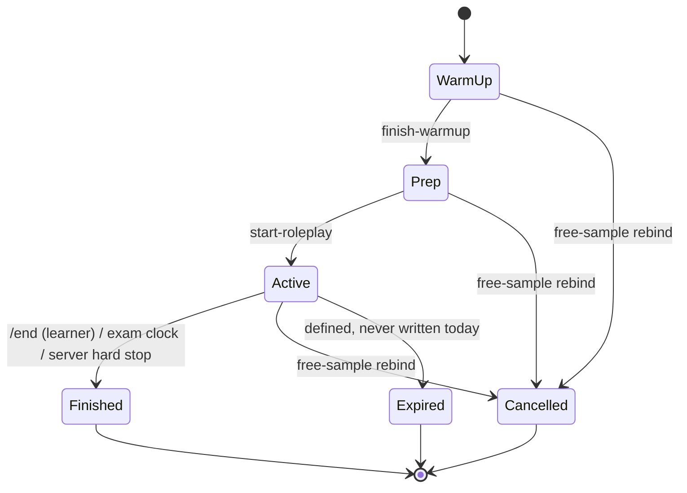
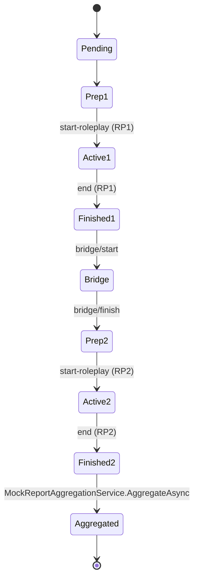
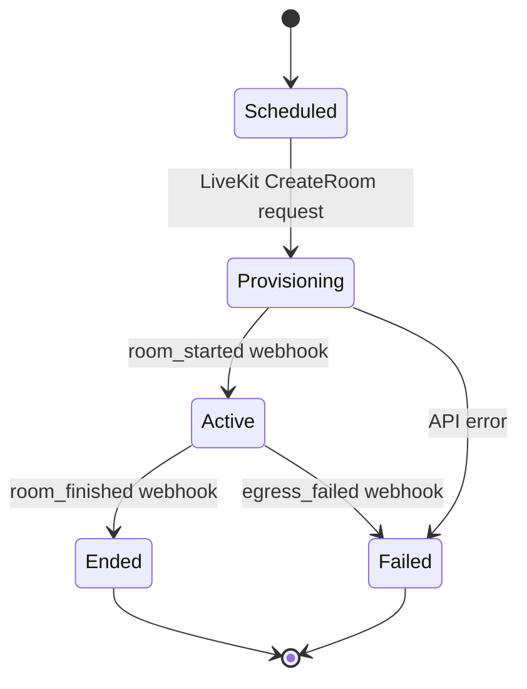

# Speaking Module — State Machines

## `SpeakingSession`

```mermaid
stateDiagram-v2
  [*] --> WarmUp
  WarmUp --> Prep: finish-warmup
  Prep --> Active: start-roleplay
  Active --> Finished: /end (learner) / exam clock / server hard stop
  Active --> Cancelled: free-sample rebind
  Prep --> Cancelled: free-sample rebind
  WarmUp --> Cancelled: free-sample rebind
  Finished --> [*]
  Cancelled --> [*]
  Active --> Expired: defined, never written today
  Expired --> [*]
```

Guarded transitions: any skip (e.g. WarmUp → Active) is refused with 409 `speaking_session_warmup_not_finished` or
`speaking_session_invalid_state` (and `speaking_session_exam_managed` for the standalone start/end of an exam card). Verified by
`SpeakingStateMachineGuardsTests`.

> **Update 2026-09-30 (live voice close-out; pending production verification).** The lifecycle is no longer only
> client-driven. In the live voice path `Active` ends in one of three ways, all landing in `Finished`:
>
> - the learner's `POST /end` (standalone sessions; an exam card answers 409 `speaking_session_exam_managed`);
> - the **exam clock**, for exam cards: the exam service ends the card at `ActiveXStartedAt` + the (capped) card seconds and
>   grades it; an exam cancel also ends its cards as `Finished`;
> - the **server hard stop**: the ai-worker's `SpeakingExamAutoAdvanceWorker` (every 20 s) finishes an Active AI role-play the
>   client never ended once it is past its deadline + grace (`EndedAt` = the deadline, audit event
>   `SpeakingRolePlayHardStopped`), with an Active to Finished compare-and-swap so a race with `/end` finishes it once. Only an
>   exam card is then graded; abandoned standalone practice is finished but not graded. A dropped browser or a closed tab
>   ends nothing by itself: this is what finishes the session.
>
> The legacy `ConversationHub` role-play timer and the corpus compatibility harness call the same `EndSessionAsync` as `/end`.
>
> `Cancelled` is written only when a started-but-unsubmitted free-sample use is released (the rebind); there is no cancel
> endpoint for a standalone session. `Expired` exists in the enum but no service writes it for a `SpeakingSession` (an idle
> exam expires through `SpeakingExamState.Expired` instead). Details, numbers and the OpenAI hang-up:
> [live-voice.md](live-voice.md#hard-duration-cap).

## `SpeakingMockSession`

```mermaid
stateDiagram-v2
  [*] --> Pending
  Pending --> Prep1
  Prep1 --> Active1: start-roleplay (RP1)
  Active1 --> Finished1: end (RP1)
  Finished1 --> Bridge: bridge/start
  Bridge --> Prep2: bridge/finish
  Prep2 --> Active2: start-roleplay (RP2)
  Active2 --> Finished2: end (RP2)
  Finished2 --> Aggregated: MockReportAggregationService.AggregateAsync
  Aggregated --> [*]
```

Aggregation averages the two `SpeakingAiAssessment` rows into the combined readiness band.

## `SpeakingLiveRoom`

```mermaid
stateDiagram-v2
  [*] --> Scheduled
  Scheduled --> Provisioning: LiveKit CreateRoom request
  Provisioning --> Active: room_started webhook
  Active --> Ended: room_finished webhook
  Provisioning --> Failed: API error
  Active --> Failed: egress_failed webhook
  Ended --> [*]
  Failed --> [*]
```

Webhook events are append-only into `SpeakingLiveRoom.WebhookEventsJson` with HMAC verification.

## Cancellation rules

- Cancellation allowed from any non-terminal state. Audit row written.
- Recording (if any partial chunks exist) is preserved or purged based on consent state.
- As of 2026-09-30 the code paths that cancel are the exam cancel (`SpeakingExamService.CancelAsync`: the exam becomes
  `Cancelled`, its cards are ended as `Finished`, unsettled credit holds are released) and the free-sample rebind (the released
  `SpeakingSession` becomes `Cancelled`); the audit-row and recording rules above were not re-verified in that pass.
