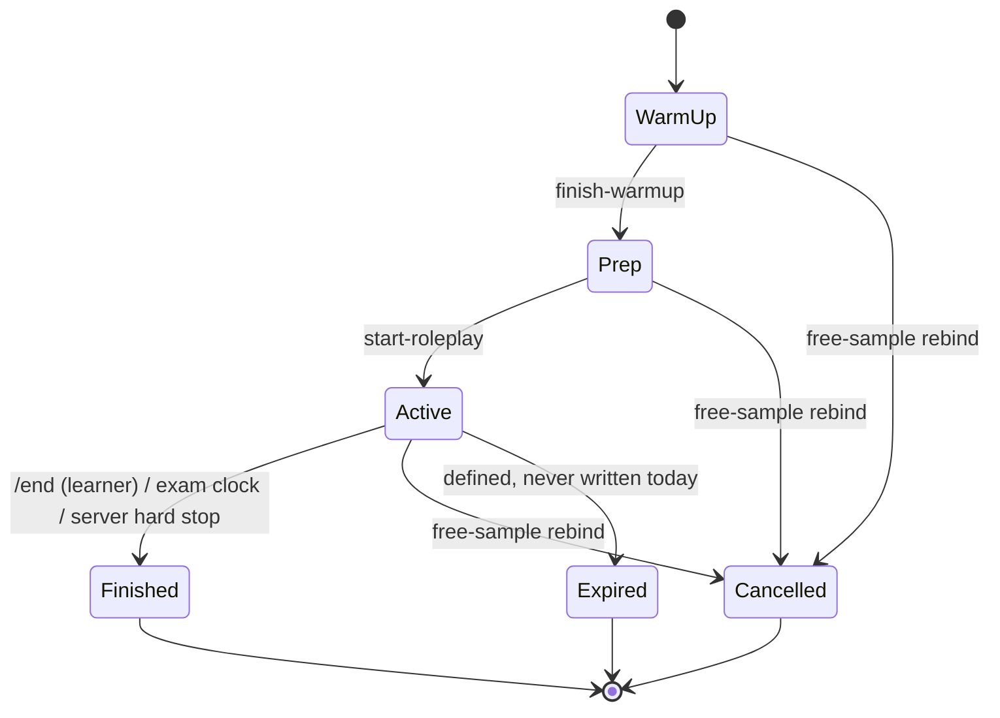
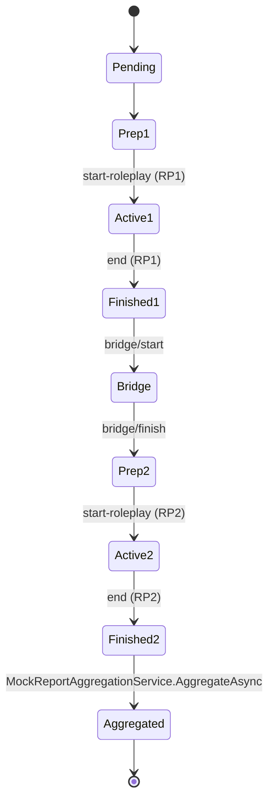
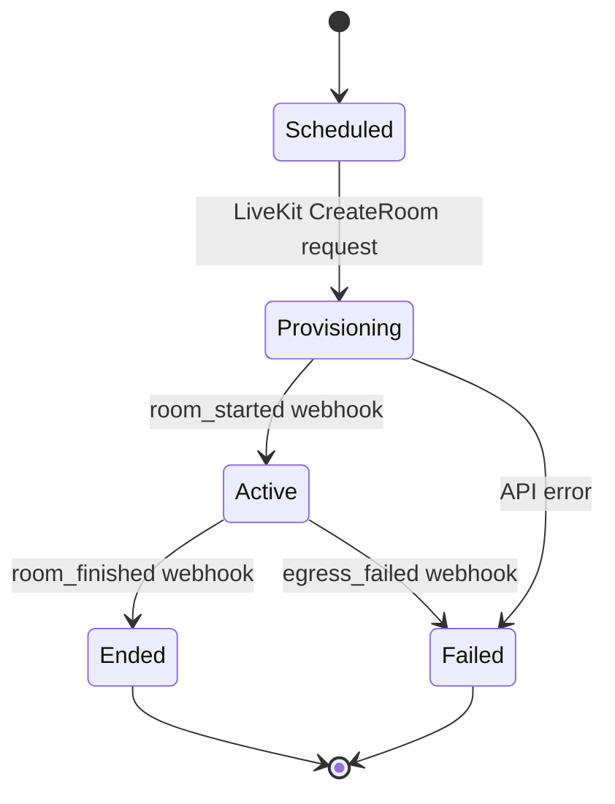

# Speaking Module — State Machines

## `SpeakingSession`

```mermaid
stateDiagram-v2
  [*] --> WarmUp
  WarmUp --> Prep: finish-warmup
  Prep --> Active: start-roleplay
  Active --> Finished: /end (learner) / exam clock / server hard stop
  Active --> Cancelled: free-sample rebind
  Prep --> Cancelled: free-sample rebind
  WarmUp --> Cancelled: free-sample rebind
  Finished --> [*]
  Cancelled --> [*]
  Active --> Expired: defined, never written today
  Expired --> [*]
```

Guarded transitions: any skip (e.g. WarmUp → Active) is refused with 409 `speaking_session_warmup_not_finished` or
`speaking_session_invalid_state` (and `speaking_session_exam_managed` for the standalone start/end of an exam card). Verified by
`SpeakingStateMachineGuardsTests`. `POST /v1/speaking/sessions` with mode `ai_exam` is refused with the same 409
`speaking_session_exam_managed` (2026-10-01): exam cards are created only by their exam, which is what takes their credit hold
([Credits: AI exam and practice card](#credits-ai-exam-and-practice-card)).

> **Update 2026-09-30 (live voice close-out; pending production verification).** The lifecycle is no longer only
> client-driven. In the live voice path `Active` ends in one of three ways, all landing in `Finished`:
>
> - the learner's `POST /end` (standalone sessions; an exam card answers 409 `speaking_session_exam_managed`);
> - the **exam clock**, for exam cards: the exam service ends the card at `ActiveXStartedAt` + the (capped) card seconds and
>   grades it; an exam cancel also ends its cards as `Finished`;
> - the **server hard stop**: the ai-worker's `SpeakingExamAutoAdvanceWorker` (every 20 s) finishes an Active AI role-play the
>   client never ended once it is past its deadline + grace (`EndedAt` = the deadline, audit event
>   `SpeakingRolePlayHardStopped`), with an Active to Finished compare-and-swap so a race with `/end` finishes it once. Only an
>   exam card is then graded; abandoned standalone practice is finished but not graded. A dropped browser or a closed tab
>   ends nothing by itself: this is what finishes the session.
>
> The legacy `ConversationHub` role-play timer and the corpus compatibility harness call the same `EndSessionAsync` as `/end`.
>
> `Cancelled` is written only when a started-but-unsubmitted free-sample use is released (the rebind); there is no cancel
> endpoint for a standalone session. `Expired` exists in the enum but no service writes it for a `SpeakingSession` (an idle
> exam expires through `SpeakingExamState.Expired` instead). Details, numbers and the OpenAI hang-up:
> [live-voice.md](live-voice.md#hard-duration-cap).

## `SpeakingMockSession`

```mermaid
stateDiagram-v2
  [*] --> Pending
  Pending --> Prep1
  Prep1 --> Active1: start-roleplay (RP1)
  Active1 --> Finished1: end (RP1)
  Finished1 --> Bridge: bridge/start
  Bridge --> Prep2: bridge/finish
  Prep2 --> Active2: start-roleplay (RP2)
  Active2 --> Finished2: end (RP2)
  Finished2 --> Aggregated: MockReportAggregationService.AggregateAsync
  Aggregated --> [*]
```

Aggregation averages the two `SpeakingAiAssessment` rows into the combined readiness band.

## `SpeakingLiveRoom`

```mermaid
stateDiagram-v2
  [*] --> Scheduled
  Scheduled --> Provisioning: LiveKit CreateRoom request
  Provisioning --> Active: room_started webhook
  Active --> Ended: room_finished webhook
  Provisioning --> Failed: API error
  Active --> Failed: egress_failed webhook
  Ended --> [*]
  Failed --> [*]
```

Webhook events are append-only into `SpeakingLiveRoom.WebhookEventsJson` with HMAC verification.

## Cancellation rules

- Cancellation allowed from any non-terminal state. Audit row written.
- Recording (if any partial chunks exist) is preserved or purged based on consent state.
- As of 2026-09-30 the code paths that cancel are the exam cancel (`SpeakingExamService.CancelAsync`: the exam becomes
  `Cancelled`, its cards are ended as `Finished`, unsettled credit holds are released: see
  [Credits: AI exam and practice card](#credits-ai-exam-and-practice-card)) and the free-sample rebind (the released
  `SpeakingSession` becomes `Cancelled`); the audit-row and recording rules above were not re-verified in that pass.

## Credits: AI exam and practice card

Added 2026-10-01 (pre-launch hardening). **Verified in production on 1 Oct 2026** for the hold timing and the "exactly 4, once"
invariant: a clean OpenAI mock moved the QA learner's Speaking pool 42 -> 40 (Card A hold) -> 38 (Card B hold) -> 38 (after grading
and a repeated grade), a mock with a page refresh 36 -> 34 -> 32 -> 32, each with exactly two `GradingDeduct` rows. A refused
hold (402 leaves the exam in `Intro`) and the rejection of `ai_exam` on `POST /v1/speaking/sessions` are covered by tests only.
The audit behind it found no path that debits an
exam card twice. It found paths that could charge too little (a card running without its hold) and one window that could leave a
debit without its reservation row; the changes below close the ones that were cheap to close.

**When credits are held**

- Practice card: 2 AI credits are held at `POST /v1/speaking/sessions/{id}/finish-warmup` (reservation reference
  `practice:{sessionId}`, reserved before the session state changes).
- Full AI mock, Card A (2 credits): held **first**, inside `POST /v1/speaking/exams/{id}/finish-intro`, before the exam row or its
  child session is touched. A refused hold (402) therefore leaves the exam in `Intro` with nothing persisted (no child session,
  no reference, no reservation, no ledger row), so the candidate can top up and press Begin again. Before this change the exam
  moved to `PrepA` and its child session was saved first, so a refused hold left Card A running unpaid.
- Full AI mock, Card B (2 credits): held at the Card A to Card B reveal (the 2 + 2 timing is unchanged).
- For accounts that hold a package wallet, `finish-intro` first re-checks that **both** cards are fundable
  (`AvailableSpeakingActivities >= 2`, the same simulation as `POST /v1/speaking/exams`), because the balance can change after the
  exam was created. Exempt: an exam covered by the learner's own mock attempt, an account with a Full Mock Speaking Exam Access
  unit (one unit funds the whole exam, ledger reference `exam:{id}:mock`) and an account with no wallet at all (the Card A hold
  itself refuses it with 402 `ai_credits_insufficient`). A retry that already holds Card A skips the check and adopts the
  existing hold.
- `POST /v1/speaking/sessions` no longer accepts mode `ai_exam` (409 `speaking_session_exam_managed`): exam cards are only
  created by their exam, which is what takes their hold.

**Invariants: exactly 4, charged once**

- Ledger: two `GradingDeduct` rows, `referenceId` `exam:{examId}:cardA` and `exam:{examId}:cardB`, -2 each from whichever pool
  funds the card (dedicated Speaking credits, then Flexible W/S, then Shared). The unique index
  `UX_AiPackageCreditTransactions_Reference_Reason` plus the `already_debited` pre-check make a repeated reference a no-op.
- Reservation: one `AiCreditReservations` row per reference (unique `BusinessReference`), `Reserved` from the reveal;
  `Committed` exactly once when **both** cards are graded (a state flip, never a second debit); `Released` (a
  `RefundOnFailure` ledger row with `referenceId` `{ref}:release`) on cancel, or by the 24 h stale-hold sweep when the exam is not
  fully graded.
- The reservation insert after a committed debit ignores the request's cancellation token, so a client timeout cannot leave a
  debit with no reservation row. A concurrent insert for the same reference makes the loser adopt the winner's row. Only request
  cancellation is covered: a process crash between the committed debit and the insert could still leave an orphan debit (a retry
  adopts it for exams).
- Live voice preflight, provider-session mints, reconnects, failover to the other provider, saved turns and the transcript never
  touch the credit tables. Grading retries (`ai-assess` again, results re-polls, worker redelivery, fail then succeed) reuse the
  same hold and commit it once. Covered by `SpeakingLiveVoiceCreditSafetyTests`, `SpeakingSessionGradingTests` and
  `SpeakingExamServiceTests`.

**Rows to expect after a clean exam**

- `AiPackageCreditTransactions`: two `GradingDeduct` rows (-4 in total) and no `RefundOnFailure` row. A mock-unit exam has one
  `MockDeduct` row `exam:{id}:mock` (one mock unit), no `GradingDeduct` row and no reservation; an exam covered by the learner's
  own mock attempt has no row at all (reference `exam:{id}:mock-attempt`).
- `AiCreditReservations`: two rows (units 2), `Reserved` from each card's reveal and `Committed` once both cards have an
  assessment.
- `AiOperations`: two grading operations (`Completed`) and, per reservation, one placeholder operation (module `speaking`,
  feature `speaking.grade`, no resource id) that nothing completes. The ai-worker leases the placeholders again every 30 minutes;
  there is no credit effect (an operational note, not changed).
- The exam row's `CreditARefId` and `CreditBRefId` hold those references.

**Residuals recorded as owner decisions (not changed)**

1. Card B is still held at the reveal, so a refusal there (the balance spent elsewhere, a package expiring inside the 8-minute
   window, a second exam begun before any hold) can leave Card B running without a hold, and because either hold funds the
   exam's grading, both cards are still graded. Shared lots such as [3,1] can pass the aggregate gate yet fail the per-lot Card B
   debit (inferred from the code, not tested). Holding both cards when Part 2 begins would close it.
2. The API-only cancel endpoint (no page calls it) can refund an already graded exam.
3. A poll and the worker advancing the exam at the Card A to Card B reveal at the same moment have no concurrency token: the
   credits stay single, but a duplicate Card B session can be orphaned.
4. A mock-unit exam is not refunded on cancel, one mock attempt can cover several exams, and a crash between the mock debit and
   the saved flag can add 2 AI credits on Card B.
