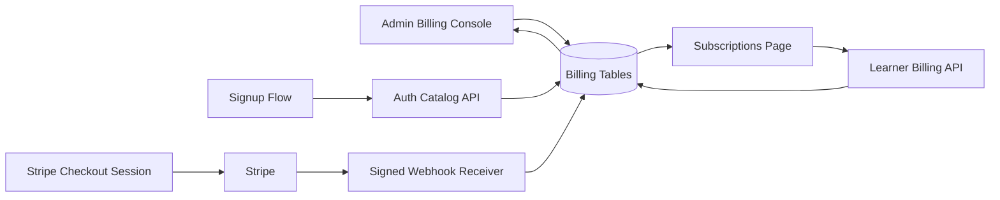

# Target Architecture

## Core Principle

The internal OET billing database remains the source of truth for plans, entitlements, invoices, and subscription state. Stripe is only the payment rail.

## Flow

## Data Contracts

- Signup catalog returns published plans with price, credits, trial days, included subtests, and entitlements.
- Learner billing responses return current plan, plans, add-ons, coupons, invoices, and quotes.
- Checkout responses return a short-lived Stripe URL plus an internal quote identifier.
- Webhooks update the internal subscription record and reconcile duplicate or replayed events safely.

## UX Contracts

- `/subscriptions` is the canonical learner route.
- `/billing` remains available as an alias.
- Payment return states are surfaced back to the learner through query parameters and a banner.
